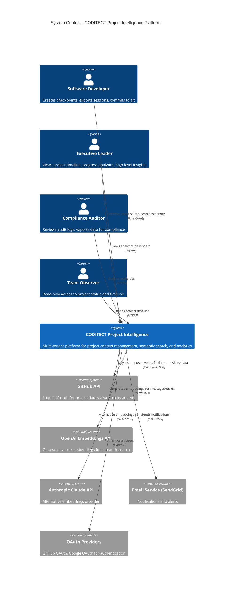
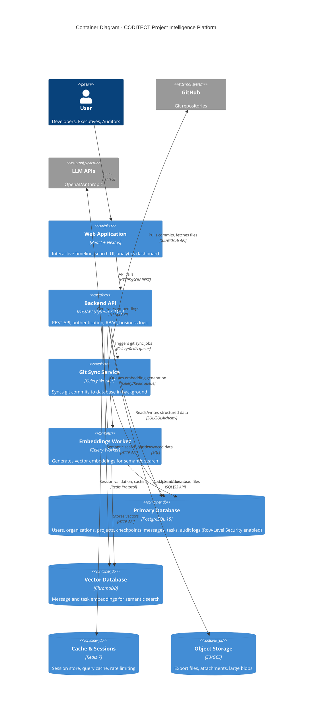
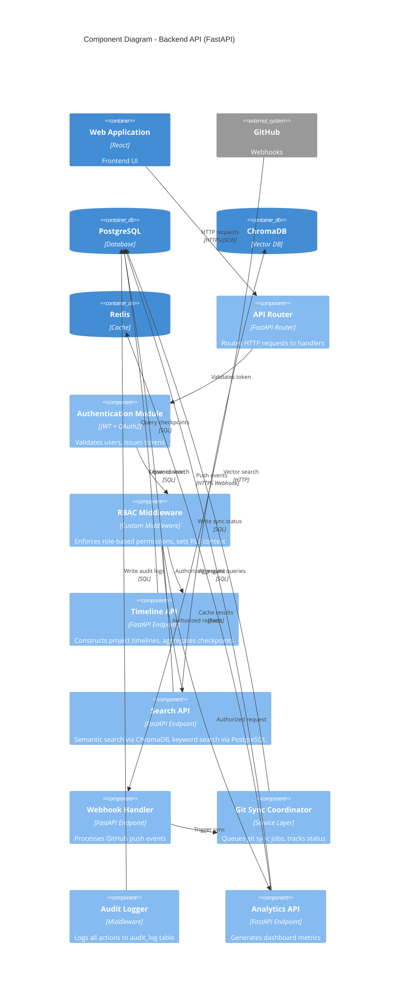
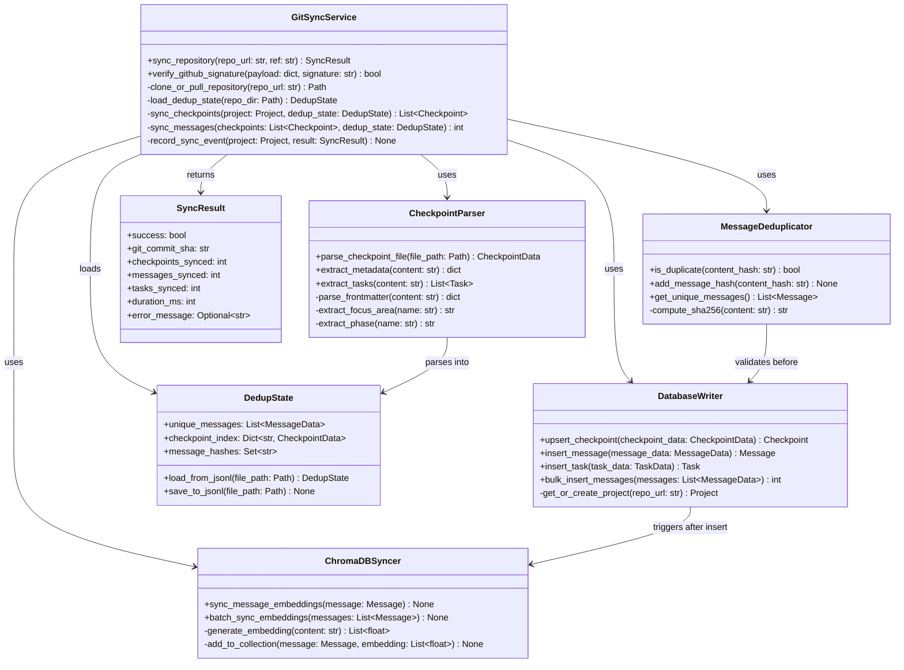
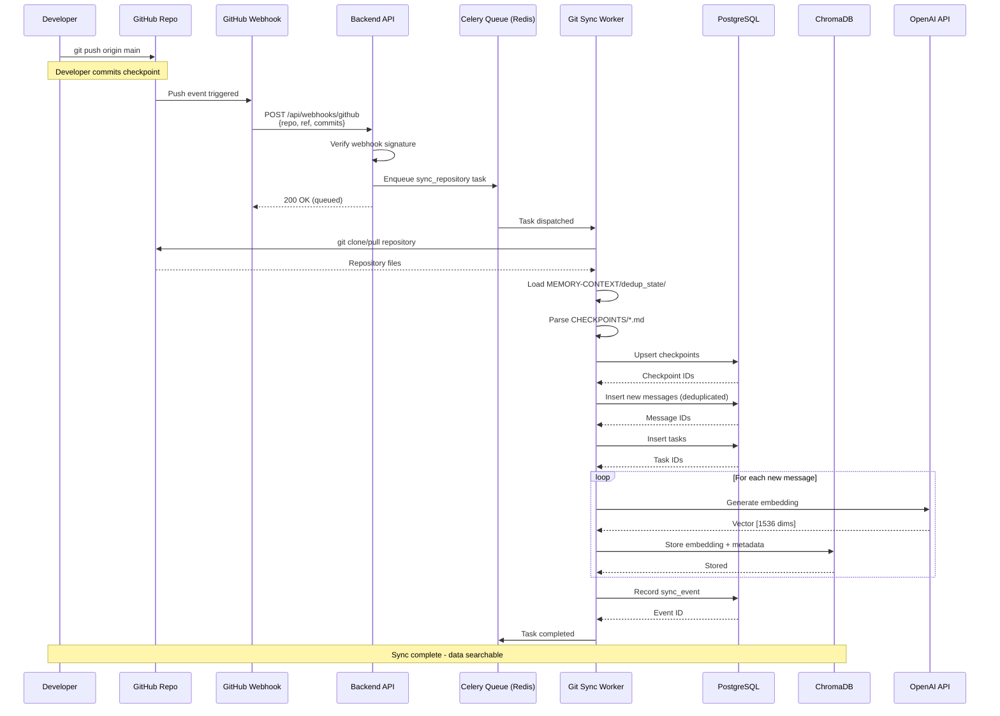
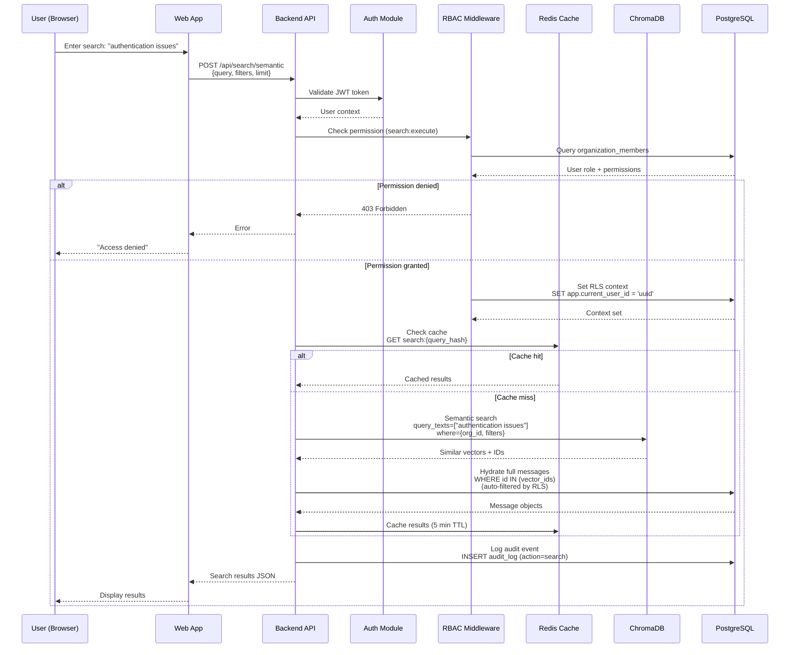
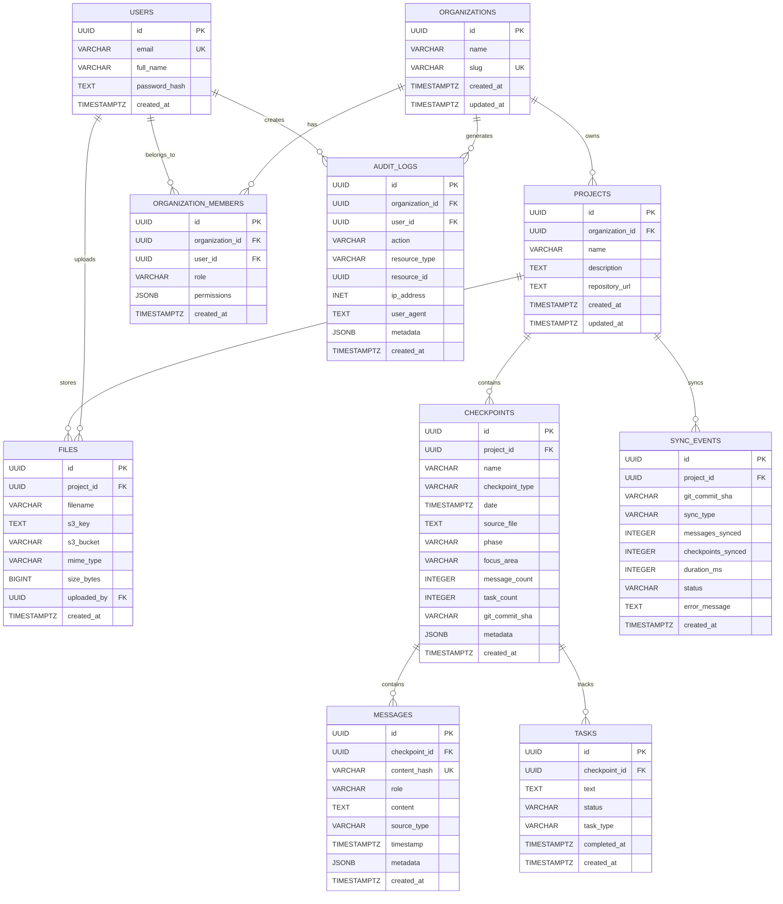
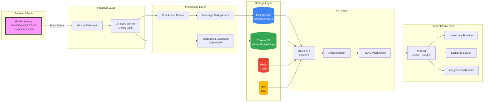
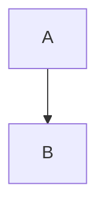

# C4 Model Diagrams - CODITECT Project Intelligence Platform

**Copyright © 2025 AZ1.AI INC. All Rights Reserved.**
**Developed by Hal Casteel, Founder/CEO/CTO, AZ1.AI INC.**

**Document Version:** 1.0
**Created:** 2025-11-17
**Status:** Architecture Design

---

## Table of Contents

1. [Level 1: System Context Diagram](#level-1-system-context-diagram)
2. [Level 2: Container Diagram](#level-2-container-diagram)
3. [Level 3: Component Diagram (Backend API)](#level-3-component-diagram-backend-api)
4. [Level 4: Code Diagram (Git Sync Service)](#level-4-code-diagram-git-sync-service)
5. [Supplementary Diagrams](#supplementary-diagrams)
   - [Deployment Diagram (GCP Infrastructure)](#deployment-diagram-gcp-infrastructure)
   - [Sequence Diagram: Git Sync Flow](#sequence-diagram-git-sync-flow)
   - [Sequence Diagram: User Query Flow](#sequence-diagram-user-query-flow)
   - [Entity-Relationship Diagram (PostgreSQL)](#entity-relationship-diagram-postgresql)
   - [Data Flow Diagram](#data-flow-diagram)
6. [GitHub SVG Export Instructions](#github-svg-export-instructions)

---

## Level 1: System Context Diagram

**Purpose:** Shows the CODITECT Project Intelligence Platform in its environment, with external actors and systems.

**Scope:** Highest-level view of the complete system boundary.

**Key Points:**
- Multi-tenant SaaS platform for project intelligence
- Serves 4 distinct user personas (Developers, Executives, Auditors, Observers)
- Integrates with GitHub as source of truth
- Uses OpenAI/Anthropic for embeddings generation
- Provides insights through semantic search and analytics



**External Dependencies:**
- **GitHub**: Canonical source of truth - all project data lives in git repositories
- **OpenAI/Anthropic**: AI models for semantic embeddings generation
- **SendGrid**: Transactional email notifications
- **OAuth Providers**: Third-party authentication for secure access

---

## Level 2: Container Diagram

**Purpose:** Decomposes the platform into containers (applications, data stores, microservices).

**Scope:** All major runtime containers and their interactions.

**Key Points:**
- Frontend (React + Next.js) serves users
- Backend API (FastAPI) orchestrates all logic
- PostgreSQL stores structured data with Row-Level Security
- ChromaDB enables semantic vector search
- Redis provides caching and session management
- S3/GCS stores export files and attachments
- Background workers handle async tasks (git sync, embeddings)



**Container Responsibilities:**

| Container | Technology | Purpose | Scaling Strategy |
|-----------|-----------|---------|------------------|
| **Web Application** | React + Next.js | User interface, client-side routing | CDN + horizontal scaling |
| **Backend API** | FastAPI (Python) | Business logic, RBAC, orchestration | Horizontal (Cloud Run/K8s) |
| **Git Sync Service** | Celery Worker | Background git synchronization | Queue-based auto-scaling |
| **Embeddings Worker** | Celery Worker | Async embedding generation | Queue-based auto-scaling |
| **PostgreSQL** | Cloud SQL | Primary structured data store | Vertical + read replicas |
| **ChromaDB** | Self-hosted | Vector search engine | Sharding by organization |
| **Redis** | Cloud Memorystore | Session + cache | Master-replica replication |
| **S3/GCS** | Cloud Storage | Infinite file storage | Auto-scaling (managed) |

---

## Level 3: Component Diagram (Backend API)

**Purpose:** Breaks down the Backend API container into logical components.

**Scope:** Internal architecture of the FastAPI backend service.

**Key Points:**
- Authentication handles OAuth and JWT validation
- RBAC Middleware enforces role-based permissions
- Timeline API constructs project timelines from checkpoints
- Search API provides semantic and keyword search
- Git Sync Coordinator manages webhook processing
- Audit Logger tracks all user actions for compliance



**Component Details:**

### 1. Authentication Module
```python
# Responsibilities:
- OAuth2 integration (GitHub, Google)
- JWT token generation and validation
- Password hashing (Argon2)
- MFA verification (TOTP)
- Session management

# Technologies:
- FastAPI Security utilities
- python-jose (JWT)
- passlib (password hashing)
```

### 2. RBAC Middleware
```python
# Responsibilities:
- Role validation (owner, admin, member, viewer, auditor, executive)
- Permission checking (granular permissions)
- PostgreSQL RLS context setting (app.current_user_id)
- Request authorization

# Key Function:
@require_permission("checkpoints:read")
async def get_checkpoint(checkpoint_id: UUID, current_user: User):
    # Middleware sets RLS context, database auto-filters by organization
    return db.query(Checkpoint).filter_by(id=checkpoint_id).first()
```

### 3. Timeline API
```python
# Responsibilities:
- Aggregate checkpoints by date
- Generate timeline view (month, year, all-time)
- Calculate statistics (message count, task count)
- Filter by project, focus area, phase

# Example Query:
GET /api/projects/{project_id}/timeline?year=2025&month=11
```

### 4. Search API
```python
# Responsibilities:
- Semantic search via ChromaDB vector similarity
- Keyword search via PostgreSQL full-text search
- Hybrid search (combine both)
- Filter by organization, project, date range

# Example Query:
POST /api/search/semantic
{
  "query": "authentication issues in backend",
  "filters": {"focus_area": "Backend"},
  "limit": 10
}
```

### 5. Git Sync Coordinator
```python
# Responsibilities:
- Process GitHub webhook payloads
- Queue Celery background jobs
- Track sync status (success, failed, in_progress)
- Handle manual sync requests

# Workflow:
1. GitHub webhook → Verify signature
2. Extract repo URL, commit SHA
3. Queue Celery task for background sync
4. Return 200 OK immediately
```

### 6. Audit Logger
```python
# Responsibilities:
- Log all user actions (view, create, update, delete)
- Capture metadata (IP address, user agent, timestamp)
- Compliance reporting (GDPR, SOC 2)
- Real-time alert triggers

# Logged Actions:
- view_checkpoint
- export_data
- invite_user
- change_permissions
- delete_project
```

---

## Level 4: Code Diagram (Git Sync Service)

**Purpose:** Detailed class-level design of the Git Sync Service component.

**Scope:** Implementation details of the most critical background service.

**Key Points:**
- GitSyncService orchestrates the entire sync workflow
- CheckpointParser extracts structured data from markdown files
- MessageDeduplicator prevents duplicate message insertion
- DatabaseWriter handles upserts to PostgreSQL
- ChromaDBSyncer manages vector embeddings



**Code Implementation Example:**

```python
# git_sync_service.py

import hashlib
import subprocess
from pathlib import Path
from typing import List, Dict, Optional
from dataclasses import dataclass
from datetime import datetime
import json

@dataclass
class SyncResult:
    success: bool
    git_commit_sha: str
    checkpoints_synced: int
    messages_synced: int
    tasks_synced: int
    duration_ms: int
    error_message: Optional[str] = None


class GitSyncService:
    """
    Orchestrates git repository synchronization to database.

    Workflow:
    1. Clone/pull repository from GitHub
    2. Load deduplication state from MEMORY-CONTEXT/dedup_state/
    3. Parse checkpoints from CHECKPOINTS/*.md
    4. Upsert checkpoints to PostgreSQL
    5. Deduplicate and insert messages
    6. Extract and insert tasks
    7. Sync embeddings to ChromaDB
    8. Record sync event
    """

    def __init__(self, db_session, chromadb_client, embeddings_provider):
        self.db = db_session
        self.chromadb = chromadb_client
        self.embeddings = embeddings_provider

        self.checkpoint_parser = CheckpointParser()
        self.deduplicator = MessageDeduplicator(db_session)
        self.db_writer = DatabaseWriter(db_session)
        self.chromadb_syncer = ChromaDBSyncer(chromadb_client, embeddings_provider)

    def sync_repository(self, repo_url: str, ref: str = "main") -> SyncResult:
        """
        Main entry point for git sync.

        Args:
            repo_url: GitHub repository URL
            ref: Git branch/ref (default: main)

        Returns:
            SyncResult with sync statistics
        """
        start_time = datetime.now()

        try:
            # Step 1: Clone or pull repository
            repo_dir = self._clone_or_pull_repository(repo_url, ref)

            # Step 2: Load deduplication state
            dedup_state = self._load_dedup_state(repo_dir)

            # Step 3: Get or create project
            project = self.db_writer.get_or_create_project(repo_url)

            # Step 4: Sync checkpoints
            checkpoints = self._sync_checkpoints(project, dedup_state, repo_dir)

            # Step 5: Sync messages (deduplicated)
            messages_synced = self._sync_messages(checkpoints, dedup_state)

            # Step 6: Get git commit SHA
            git_commit_sha = self._get_git_commit_sha(repo_dir)

            # Step 7: Calculate duration
            duration_ms = int((datetime.now() - start_time).total_seconds() * 1000)

            # Step 8: Build result
            result = SyncResult(
                success=True,
                git_commit_sha=git_commit_sha,
                checkpoints_synced=len(checkpoints),
                messages_synced=messages_synced,
                tasks_synced=sum(len(cp.tasks) for cp in checkpoints),
                duration_ms=duration_ms
            )

            # Step 9: Record sync event
            self._record_sync_event(project, result)

            return result

        except Exception as e:
            duration_ms = int((datetime.now() - start_time).total_seconds() * 1000)
            return SyncResult(
                success=False,
                git_commit_sha="",
                checkpoints_synced=0,
                messages_synced=0,
                tasks_synced=0,
                duration_ms=duration_ms,
                error_message=str(e)
            )

    def _clone_or_pull_repository(self, repo_url: str, ref: str) -> Path:
        """Clone repository if not exists, otherwise pull latest."""
        repo_hash = hashlib.md5(repo_url.encode()).hexdigest()
        repo_dir = Path(f"/tmp/repos/{repo_hash}")

        if not repo_dir.exists():
            subprocess.run(["git", "clone", repo_url, str(repo_dir)], check=True)
        else:
            subprocess.run(["git", "-C", str(repo_dir), "pull", "origin", ref], check=True)

        return repo_dir

    def _load_dedup_state(self, repo_dir: Path) -> "DedupState":
        """Load deduplication state from MEMORY-CONTEXT/dedup_state/"""
        dedup_dir = repo_dir / "MEMORY-CONTEXT" / "dedup_state"
        return DedupState.load_from_jsonl(dedup_dir / "unique_messages.jsonl")

    def _sync_checkpoints(self, project, dedup_state, repo_dir: Path) -> List:
        """Parse and upsert checkpoints from CHECKPOINTS/*.md files."""
        checkpoints = []
        checkpoints_dir = repo_dir / "CHECKPOINTS"

        for checkpoint_file in checkpoints_dir.glob("*.md"):
            checkpoint_data = self.checkpoint_parser.parse_checkpoint_file(checkpoint_file)
            checkpoint = self.db_writer.upsert_checkpoint(project, checkpoint_data)
            checkpoints.append(checkpoint)

        return checkpoints

    def _sync_messages(self, checkpoints, dedup_state) -> int:
        """Sync deduplicated messages and generate embeddings."""
        messages_synced = 0

        for message_data in dedup_state.unique_messages:
            if not self.deduplicator.is_duplicate(message_data.content_hash):
                # Insert message
                message = self.db_writer.insert_message(message_data)

                # Queue embedding generation
                self.chromadb_syncer.sync_message_embeddings(message)

                messages_synced += 1

        return messages_synced

    def _get_git_commit_sha(self, repo_dir: Path) -> str:
        """Get current git commit SHA."""
        result = subprocess.run(
            ["git", "-C", str(repo_dir), "rev-parse", "HEAD"],
            capture_output=True,
            text=True,
            check=True
        )
        return result.stdout.strip()

    def _record_sync_event(self, project, result: SyncResult):
        """Record sync event in database."""
        self.db.add(SyncEvent(
            project_id=project.id,
            git_commit_sha=result.git_commit_sha,
            sync_type="webhook",
            checkpoints_synced=result.checkpoints_synced,
            messages_synced=result.messages_synced,
            duration_ms=result.duration_ms,
            status="success" if result.success else "failed",
            error_message=result.error_message
        ))
        self.db.commit()


class CheckpointParser:
    """Parses checkpoint markdown files into structured data."""

    def parse_checkpoint_file(self, file_path: Path) -> dict:
        """
        Extract checkpoint metadata and tasks from markdown file.

        Example file: 2025-11-17T10-21-00Z-Week-1-Phase-1-Complete.md
        """
        content = file_path.read_text()

        return {
            "name": file_path.stem,
            "source_file": str(file_path.relative_to(file_path.parents[2])),
            "date": self._extract_date_from_filename(file_path.name),
            "phase": self._extract_phase(file_path.stem),
            "focus_area": self._extract_focus_area(content),
            "tasks": self._extract_tasks(content),
            "metadata": self._parse_frontmatter(content)
        }

    def _extract_date_from_filename(self, filename: str) -> datetime:
        """Extract ISO datetime from filename."""
        # 2025-11-17T10-21-00Z-...
        date_part = filename.split("Z-")[0] + "Z"
        return datetime.fromisoformat(date_part.replace("Z", "+00:00"))

    def _extract_phase(self, name: str) -> str:
        """Extract phase from checkpoint name."""
        # Week-1-Phase-1-Complete → Phase-1
        parts = name.split("-")
        for i, part in enumerate(parts):
            if part.lower() == "phase" and i + 1 < len(parts):
                return f"Phase-{parts[i+1]}"
        return "Unknown"

    def _extract_focus_area(self, content: str) -> str:
        """Extract focus area from content."""
        # Look for "Focus Area: Backend" in content
        import re
        match = re.search(r'Focus Area:\s*(\w+)', content)
        return match.group(1) if match else "General"

    def _extract_tasks(self, content: str) -> List[dict]:
        """Extract completed tasks from checkbox format."""
        import re
        tasks = []

        # Match: - [x] Task description
        completed_tasks = re.findall(r'- \[x\] (.+)', content)
        for task_text in completed_tasks:
            tasks.append({
                "text": task_text.strip(),
                "status": "completed",
                "task_type": "checkbox"
            })

        return tasks

    def _parse_frontmatter(self, content: str) -> dict:
        """Parse YAML frontmatter if exists."""
        import yaml
        if content.startswith("---"):
            parts = content.split("---", 2)
            if len(parts) >= 3:
                return yaml.safe_load(parts[1])
        return {}


class MessageDeduplicator:
    """Prevents duplicate message insertion using content hashes."""

    def __init__(self, db_session):
        self.db = db_session
        self._cache = set()

    def is_duplicate(self, content_hash: str) -> bool:
        """Check if message already exists in database."""
        if content_hash in self._cache:
            return True

        exists = self.db.query(Message).filter_by(content_hash=content_hash).first()
        if exists:
            self._cache.add(content_hash)
            return True

        return False

    def compute_sha256(self, content: str) -> str:
        """Compute SHA-256 hash of message content."""
        return hashlib.sha256(content.encode()).hexdigest()


class DatabaseWriter:
    """Handles database writes with upsert logic."""

    def __init__(self, db_session):
        self.db = db_session

    def get_or_create_project(self, repo_url: str):
        """Get existing project or create new one."""
        project = self.db.query(Project).filter_by(repository_url=repo_url).first()

        if not project:
            # Extract project name from URL
            project_name = repo_url.split("/")[-1].replace(".git", "")
            project = Project(
                organization_id=self._get_default_org_id(),
                name=project_name,
                repository_url=repo_url
            )
            self.db.add(project)
            self.db.commit()

        return project

    def upsert_checkpoint(self, project, checkpoint_data: dict):
        """Insert or update checkpoint."""
        checkpoint = self.db.query(Checkpoint).filter_by(
            project_id=project.id,
            name=checkpoint_data["name"]
        ).first()

        if not checkpoint:
            checkpoint = Checkpoint(
                project_id=project.id,
                **checkpoint_data
            )
            self.db.add(checkpoint)
        else:
            # Update existing
            for key, value in checkpoint_data.items():
                setattr(checkpoint, key, value)

        self.db.commit()
        return checkpoint

    def insert_message(self, message_data: dict):
        """Insert new message."""
        message = Message(**message_data)
        self.db.add(message)
        self.db.commit()
        return message


class ChromaDBSyncer:
    """Syncs messages to ChromaDB for semantic search."""

    def __init__(self, chromadb_client, embeddings_provider):
        self.client = chromadb_client
        self.embeddings = embeddings_provider
        self.collection = self.client.get_or_create_collection("messages")

    def sync_message_embeddings(self, message):
        """Generate and store vector embeddings for message."""
        # Generate embedding
        embedding = self.embeddings.generate(message.content)

        # Add to ChromaDB
        self.collection.add(
            documents=[message.content],
            embeddings=[embedding],
            metadatas=[{
                "checkpoint_id": str(message.checkpoint_id),
                "role": message.role,
                "timestamp": message.timestamp.isoformat() if message.timestamp else None
            }],
            ids=[str(message.id)]
        )
```

**Key Design Patterns:**
- **Strategy Pattern**: Embeddings provider can be swapped (OpenAI, Anthropic, local)
- **Repository Pattern**: DatabaseWriter abstracts database operations
- **Command Pattern**: GitSyncService executes sync as discrete operation
- **Chain of Responsibility**: Checkpoint → Messages → Tasks → Embeddings pipeline

---

## Supplementary Diagrams

### Deployment Diagram (GCP Infrastructure)

**Purpose:** Shows physical deployment architecture on Google Cloud Platform.

```mermaid
graph TB
    subgraph "Internet"
        Users[Users/Browsers]
        GitHub[GitHub Webhooks]
    end

    subgraph "GCP - us-central1"
        subgraph "Cloud CDN"
            CDN[Cloud CDN<br/>Static Assets]
        end

        subgraph "Cloud Load Balancer"
            LB[HTTPS Load Balancer<br/>SSL Termination]
        end

        subgraph "Cloud Run"
            WebApp[Web App Container<br/>React + Next.js<br/>Auto-scale 0-100]
            API1[API Container 1<br/>FastAPI<br/>Min 2 instances]
            API2[API Container 2<br/>FastAPI]
            API3[API Container N<br/>FastAPI]
        end

        subgraph "Cloud Run - Background Workers"
            Worker1[Git Sync Worker<br/>Celery]
            Worker2[Embeddings Worker<br/>Celery]
        end

        subgraph "Managed Databases"
            CloudSQL[(Cloud SQL PostgreSQL<br/>High Availability<br/>Automatic Backups)]
            Memorystore[(Cloud Memorystore Redis<br/>Standard Tier)]
        end

        subgraph "Storage"
            GCS[Cloud Storage Buckets<br/>Export files, attachments]
        end

        subgraph "Self-Hosted on Compute Engine"
            ChromaDB[ChromaDB Instance<br/>e2-standard-4<br/>100GB SSD]
        end

        subgraph "Monitoring"
            Logging[Cloud Logging]
            Monitoring[Cloud Monitoring]
            Trace[Cloud Trace]
        end
    end

    subgraph "External Services"
        OpenAI[OpenAI API]
        Anthropic[Anthropic API]
        SendGrid[SendGrid Email]
    end

    Users -->|HTTPS| CDN
    Users -->|HTTPS| LB
    GitHub -->|Webhook| LB

    CDN --> LB
    LB --> WebApp
    LB --> API1
    LB --> API2
    LB --> API3

    WebApp --> API1

    API1 --> CloudSQL
    API2 --> CloudSQL
    API3 --> CloudSQL

    API1 --> Memorystore
    API1 --> ChromaDB
    API1 --> GCS

    API1 -.->|Queue| Worker1
    API1 -.->|Queue| Worker2

    Worker1 --> CloudSQL
    Worker1 --> ChromaDB
    Worker2 --> CloudSQL
    Worker2 --> ChromaDB

    Worker2 --> OpenAI
    Worker2 --> Anthropic

    API1 --> SendGrid

    API1 -.-> Logging
    API1 -.-> Monitoring
    API1 -.-> Trace

    style CloudSQL fill:#4285f4,stroke:#1967d2,color:#fff
    style Memorystore fill:#4285f4,stroke:#1967d2,color:#fff
    style GCS fill:#4285f4,stroke:#1967d2,color:#fff
    style ChromaDB fill:#34a853,stroke:#188038,color:#fff
```

**Infrastructure Details:**

| Component | GCP Service | Configuration | Cost (est.) |
|-----------|-------------|---------------|-------------|
| **Frontend** | Cloud Run | Auto-scale 0-100, 512MB RAM | $30/month |
| **Backend API** | Cloud Run | Min 2, max 20 instances, 1GB RAM | $100/month |
| **PostgreSQL** | Cloud SQL | db-n1-standard-2, 100GB SSD, HA | $200/month |
| **Redis** | Cloud Memorystore | Standard tier, 5GB | $50/month |
| **ChromaDB** | Compute Engine | e2-standard-4, 100GB SSD | $120/month |
| **Storage** | Cloud Storage | Standard class, 500GB | $20/month |
| **CDN** | Cloud CDN | 1TB egress/month | $40/month |
| **Total** | - | - | **~$560/month** |

**High Availability:**
- Cloud SQL: Multi-zone replication (99.95% SLA)
- Cloud Run: Auto-scaling across zones
- Cloud Storage: 11 nines durability
- Redis: Standard tier with failover

---

### Sequence Diagram: Git Sync Flow

**Purpose:** Shows real-time git synchronization when developer pushes to GitHub.



**Performance Characteristics:**
- Webhook response time: <200ms (immediate queue, async processing)
- Sync latency: 5-30 seconds (depends on repo size)
- Embedding generation: 0.5s per message (OpenAI API)
- Database writes: Batched for efficiency

---

### Sequence Diagram: User Query Flow

**Purpose:** Shows semantic search workflow from user query to results.



**Performance Optimizations:**
- Redis caching: 5-minute TTL for search results
- ChromaDB indexes: HNSW algorithm for fast vector search
- PostgreSQL RLS: Automatic tenant filtering (no app-level joins)
- Pagination: Limit results to 10-50 per query

---

### Entity-Relationship Diagram (PostgreSQL)

**Purpose:** Complete database schema with relationships and constraints.



**Key Constraints:**
- `messages.content_hash` UNIQUE: Prevents duplicate messages
- `organization_members (org_id, user_id)` UNIQUE: One role per user per org
- `organizations.slug` UNIQUE: URL-friendly org identifiers
- All foreign keys: ON DELETE CASCADE (except audit logs)

**Indexes:**
```sql
-- Performance indexes
CREATE INDEX idx_checkpoints_project_date ON checkpoints(project_id, date DESC);
CREATE INDEX idx_messages_checkpoint ON messages(checkpoint_id);
CREATE INDEX idx_messages_hash ON messages(content_hash);
CREATE INDEX idx_tasks_checkpoint ON tasks(checkpoint_id);
CREATE INDEX idx_audit_log_org_created ON audit_log(organization_id, created_at DESC);
CREATE INDEX idx_checkpoints_git_sha ON checkpoints(git_commit_sha);

-- Full-text search
CREATE INDEX idx_messages_content_fts ON messages USING gin(to_tsvector('english', content));
CREATE INDEX idx_tasks_text_fts ON tasks USING gin(to_tsvector('english', text));
```

---

### Data Flow Diagram

**Purpose:** Shows how data flows through the system from git to user interface.



**Data Flow Paths:**

1. **Git → Database** (Sync Path)
   ```
   Git Repo → Webhook → Sync Worker → Parser → Deduplicator → PostgreSQL
                                    → Embedding Generator → ChromaDB
   ```

2. **User Query → Results** (Read Path)
   ```
   User → Web UI → REST API → Auth → RBAC → PostgreSQL/ChromaDB → Results
   ```

3. **Caching Flow** (Performance Path)
   ```
   API → Redis (check cache) → Cache Hit: Return
                              → Cache Miss: Query DB → Store in Redis → Return
   ```

---

## GitHub SVG Export Instructions

### Method 1: Mermaid Live Editor (Recommended)

1. Visit [https://mermaid.live](https://mermaid.live)
2. Paste diagram code into left pane
3. Click "Actions" → "Export as SVG"
4. Save to `/docs/diagrams/c4-context.svg`
5. Commit to git repository
6. Reference in markdown: ``

### Method 2: GitHub Automatic Rendering

GitHub automatically renders Mermaid diagrams in markdown files. Simply use:

````markdown

````

Diagrams will render directly in GitHub's web interface and PR previews.

### Method 3: CLI Tool (mermaid-cli)

```bash
# Install mermaid-cli
npm install -g @mermaid-js/mermaid-cli

# Convert diagram to SVG
mmdc -i diagram.mmd -o diagram.svg -t default -b transparent

# Batch convert all diagrams
for file in docs/diagrams/*.mmd; do
    mmdc -i "$file" -o "${file%.mmd}.svg" -t default -b transparent
done
```

### Method 4: VS Code Extension

1. Install "Markdown Preview Mermaid Support" extension
2. Open this markdown file
3. Right-click diagram → "Export as SVG"
4. Save to `/docs/diagrams/`

---

## Diagram Cross-References

### Hierarchy
```
Level 1 (Context)
    ↓ Decomposes into
Level 2 (Container)
    ↓ Focuses on "Backend API"
Level 3 (Component)
    ↓ Drills into "Git Sync Coordinator"
Level 4 (Code)
```

### Supplementary Diagrams Map
- **Deployment Diagram** complements Level 2 (Container)
- **Sequence: Git Sync** details Level 4 (Code) workflow
- **Sequence: User Query** shows Level 3 (Component) interaction
- **ER Diagram** expands "PostgreSQL" container from Level 2
- **Data Flow** shows cross-cutting system-wide flow

---

## Design Decisions Captured

### ADR-001: PostgreSQL for Primary Database
**Status:** Accepted
**Rationale:** Row-level security (RLS) provides automatic multi-tenant isolation. ACID transactions ensure data consistency. JSON support allows flexible metadata. Mature ecosystem with extensive tooling.

### ADR-002: ChromaDB for Semantic Search
**Status:** Accepted
**Rationale:** Purpose-built for vector embeddings. Native integration with LLMs. Faster than pgvector for large-scale similarity search. Simple HTTP API.

### ADR-003: Git as Source of Truth
**Status:** Accepted
**Rationale:** Version control built-in. Auditability through commit history. Disaster recovery via git clone. User trust (database can be rebuilt from git). Offline capability.

### ADR-004: Celery for Background Jobs
**Status:** Accepted
**Rationale:** Proven at scale. Redis-backed queue. Retry logic and error handling built-in. Async execution prevents webhook timeout. Monitoring via Flower.

### ADR-005: FastAPI for Backend
**Status:** Accepted
**Rationale:** Native async support. Automatic OpenAPI docs. Pydantic validation. High performance (comparable to Node.js). Python ecosystem for data processing.

---

## Next Steps

1. **Review Diagrams** with engineering team
2. **Validate Architecture** against requirements
3. **Estimate Infrastructure Costs** based on deployment diagram
4. **Create Implementation Tasks** from component and code diagrams
5. **Setup GitHub Project** with milestones
6. **Begin Phase 1** (Infrastructure setup per deployment diagram)

---

**Document Status:** ✅ Architecture Design Complete
**Owner:** Hal Casteel, CTO, AZ1.AI INC
**Last Updated:** 2025-11-17
**Next Review:** Pre-implementation kickoff

**Copyright © 2025 AZ1.AI INC. All Rights Reserved.**
