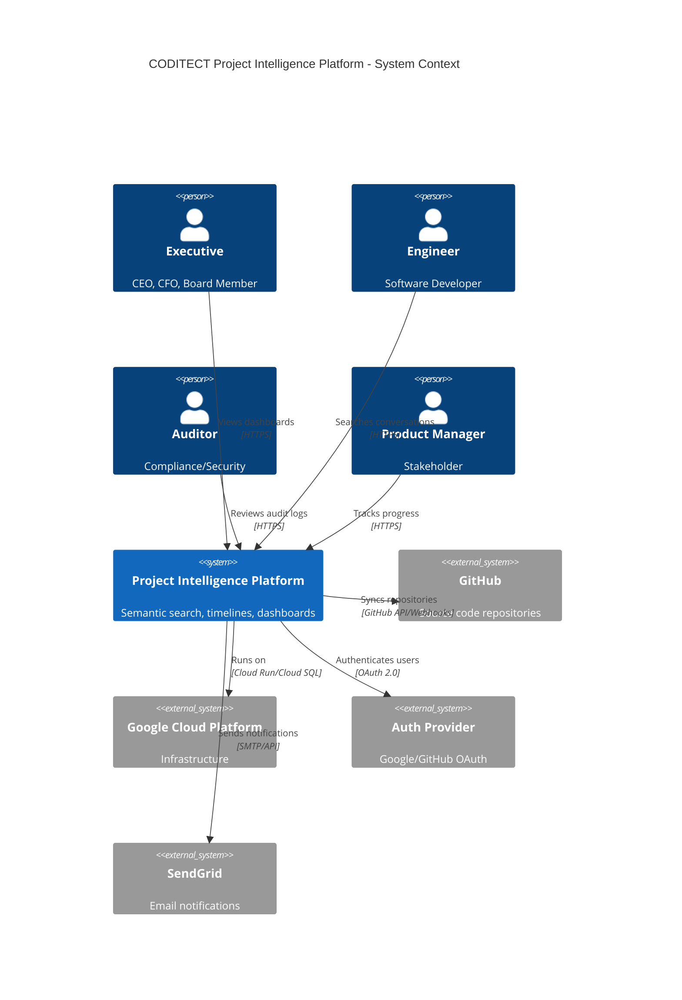
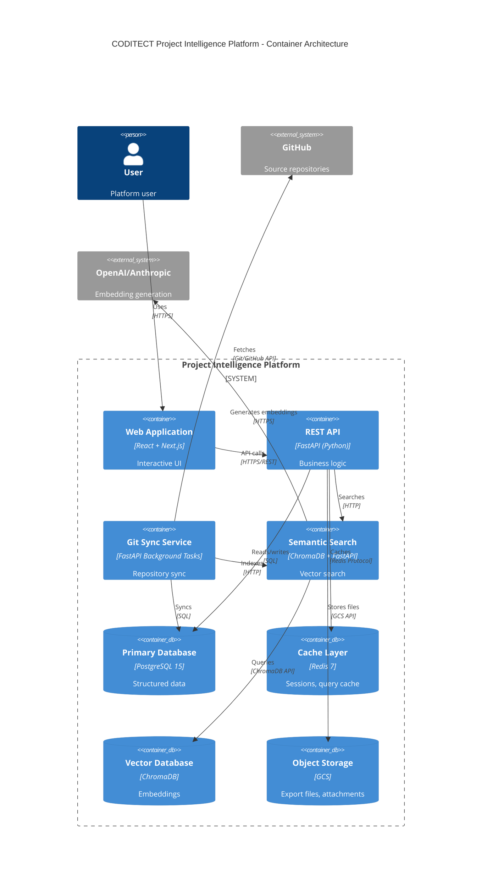
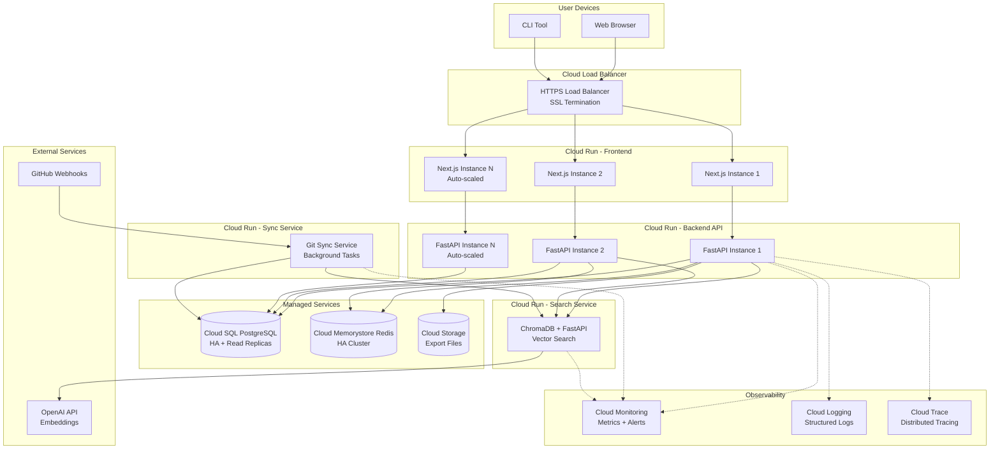
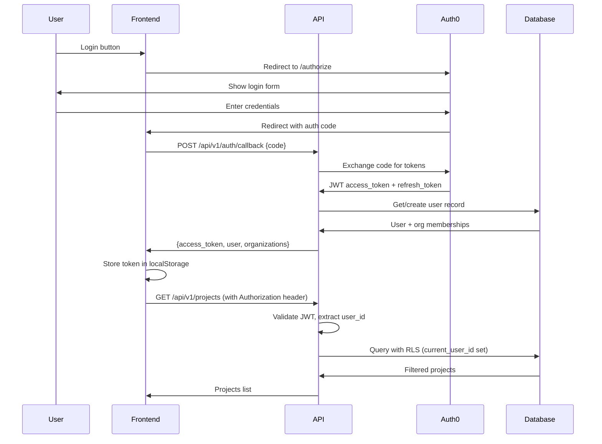
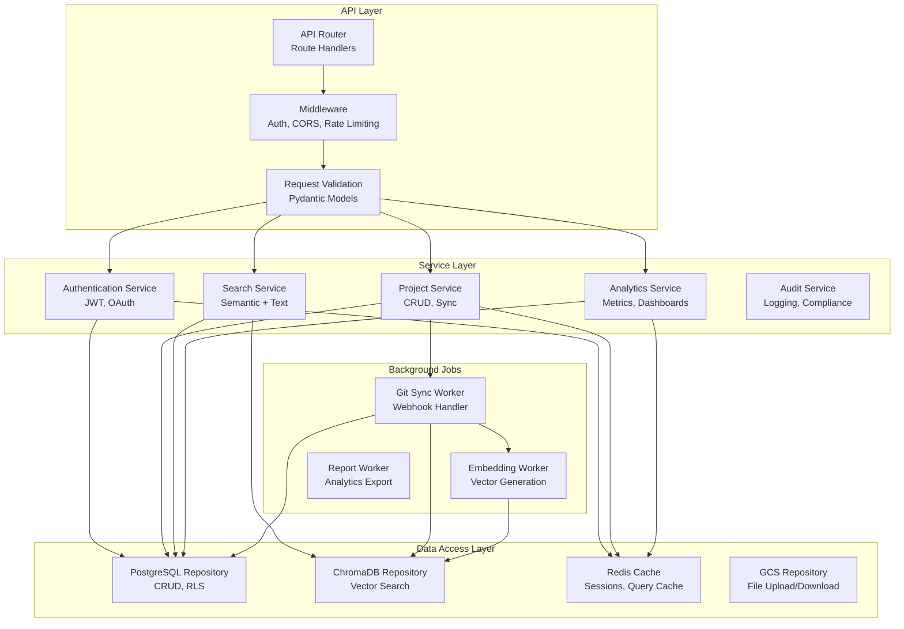
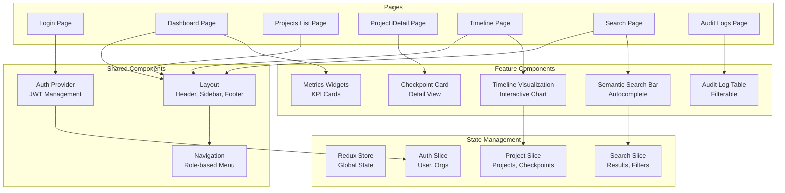
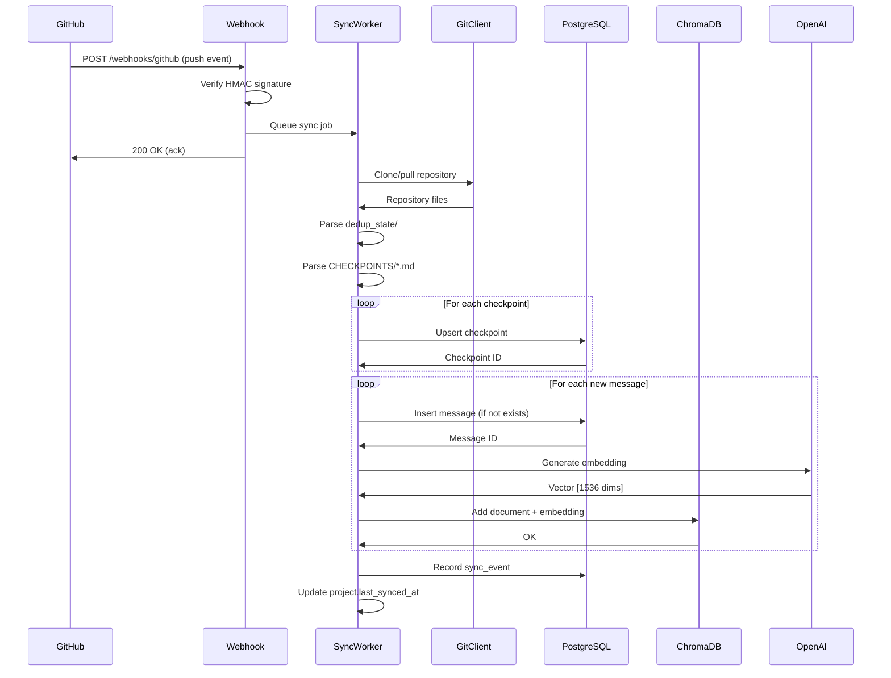
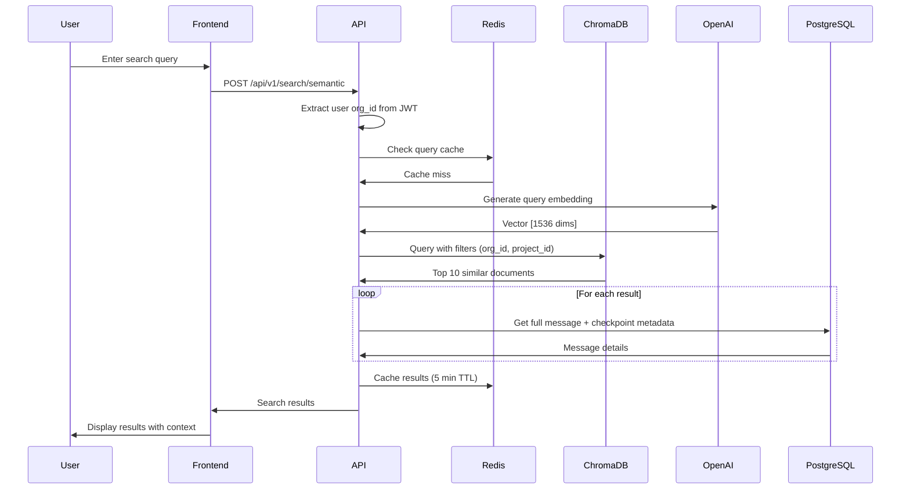
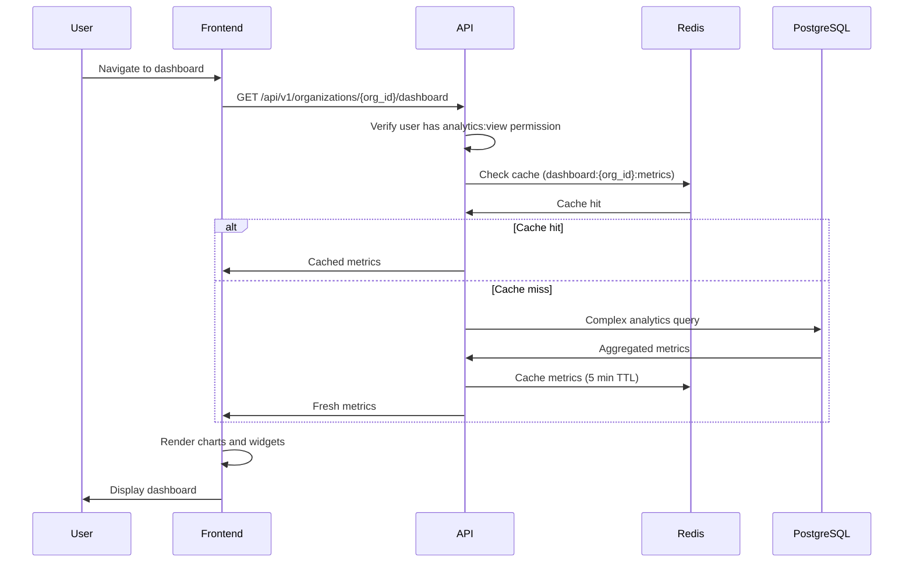
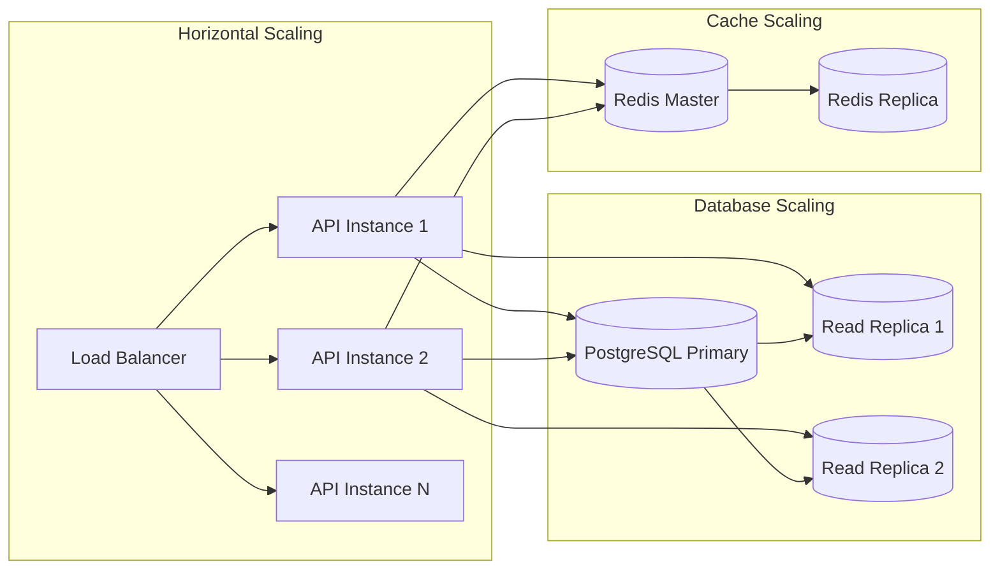

# Software Design Document: CODITECT Project Intelligence Platform

**Document Version:** 1.0
**Created:** 2025-11-17
**Status:** Design Complete - Ready for Implementation
**Owner:** AZ1.AI INC
**Project:** CODITECT Cloud Platform

---

## Executive Summary

### Purpose

The CODITECT Project Intelligence Platform is a multi-tenant SaaS application that provides **semantic search**, **interactive timeline visualization**, and **executive dashboards** for software development projects. The platform transforms git-based project artifacts (checkpoints, conversation exports, task lists) into a searchable, queryable knowledge base for project stakeholders.

### Business Problem

Modern software projects generate massive amounts of context across git commits, conversation exports, checkpoints, and task tracking. This data is:
- **Scattered** across multiple files and repositories
- **Unsearchable** beyond basic text matching
- **Inaccessible** to non-technical stakeholders
- **Lost** when team members leave or sessions are compacted

### Solution

A cloud-native platform that:
1. **Syncs** git repositories to database (git = source, database = cache)
2. **Indexes** conversations with semantic search (ChromaDB vector embeddings)
3. **Visualizes** project timelines with interactive dashboards
4. **Controls Access** with role-based permissions (executive, admin, member, viewer, auditor)
5. **Tracks Changes** with comprehensive audit logging for compliance

### Strategic Value

- **For Executives:** High-level dashboards showing project progress, velocity, blockers
- **For Engineering:** Semantic search to find relevant past discussions and decisions
- **For Auditors:** Complete audit trail of who accessed what data when
- **For Compliance:** SOC 2, GDPR-ready data management and access controls

### Key Metrics

| Metric | Target | Description |
|--------|--------|-------------|
| **Search Latency** | <500ms | Semantic search response time (p95) |
| **Sync Latency** | <30s | Git push → database sync time |
| **Query Performance** | <200ms | Timeline/dashboard queries (p95) |
| **Uptime** | 99.9% | Platform availability SLA |
| **Data Consistency** | 100% | Database matches git source (verified) |
| **Concurrent Users** | 1000+ | Simultaneous active users supported |

### Implementation Timeline

- **Week 1-2:** Infrastructure setup (Cloud SQL, Redis, ChromaDB)
- **Week 3-4:** Backend API development (FastAPI, authentication, RBAC)
- **Week 5-6:** Frontend development (React, timeline, dashboards)
- **Week 7-8:** Testing, security audit, production launch

### Budget Estimate

**Development:** $100K (2 full-stack engineers × 8 weeks)
**Infrastructure:** ~$500/month (GCP Cloud SQL, Cloud Run, Cloud Storage)
**Total Year 1:** $106K

---

## 1. System Architecture

### 1.1 Architecture Principles

1. **Git is Source of Truth** - Database is derived view for performance/search
2. **Multi-Tenant First** - Row-level security enforced at database level
3. **Security by Default** - HTTPS, encryption at rest/transit, audit logging
4. **Cloud-Native** - Serverless compute (Cloud Run), managed services
5. **Horizontally Scalable** - Stateless services, distributed caching

### 1.2 C4 System Context Diagram



### 1.3 C4 Container Diagram



### 1.4 Deployment Architecture (GCP)



### 1.5 Technology Stack

| Layer | Technology | Justification |
|-------|-----------|---------------|
| **Frontend** | React 18 + Next.js 14 + TypeScript | Modern, SSR, excellent DX |
| **Backend API** | FastAPI (Python 3.11+) | Async, auto-docs, type safety |
| **Primary Database** | PostgreSQL 15 | ACID, RLS, JSON support, mature |
| **Vector Database** | ChromaDB | AI-native, embeddings, open source |
| **Cache Layer** | Redis 7 | Sub-ms latency, pub/sub, persistence |
| **Object Storage** | Google Cloud Storage | Infinite scale, 11 nines durability |
| **Compute** | Cloud Run (GCP) | Serverless, auto-scale, pay-per-use |
| **Authentication** | Auth0 / Firebase Auth | OAuth, MFA, SSO support |
| **Observability** | GCP Monitoring + Logging | Native integration, alerting |
| **CI/CD** | GitHub Actions | Automated testing, deployment |

---

## 2. Data Architecture

### 2.1 Database Schema (PostgreSQL)

```sql
-- ==============================================================================
-- MULTI-TENANT CORE SCHEMA
-- ==============================================================================

-- Organizations (top-level tenant boundary)
CREATE TABLE organizations (
    id UUID PRIMARY KEY DEFAULT gen_random_uuid(),
    name VARCHAR(255) NOT NULL,
    slug VARCHAR(100) UNIQUE NOT NULL,
    billing_email VARCHAR(255),
    plan VARCHAR(50) DEFAULT 'free', -- 'free', 'team', 'enterprise'
    status VARCHAR(50) DEFAULT 'active', -- 'active', 'suspended', 'deleted'
    settings JSONB DEFAULT '{}',
    created_at TIMESTAMPTZ DEFAULT NOW(),
    updated_at TIMESTAMPTZ DEFAULT NOW()
);

-- Users (global user accounts)
CREATE TABLE users (
    id UUID PRIMARY KEY DEFAULT gen_random_uuid(),
    email VARCHAR(255) UNIQUE NOT NULL,
    full_name VARCHAR(255),
    password_hash TEXT NOT NULL, -- Argon2
    email_verified BOOLEAN DEFAULT FALSE,
    avatar_url TEXT,
    last_login_at TIMESTAMPTZ,
    created_at TIMESTAMPTZ DEFAULT NOW(),
    updated_at TIMESTAMPTZ DEFAULT NOW()
);

-- Organization membership (many-to-many with roles)
CREATE TABLE organization_members (
    id UUID PRIMARY KEY DEFAULT gen_random_uuid(),
    organization_id UUID REFERENCES organizations(id) ON DELETE CASCADE,
    user_id UUID REFERENCES users(id) ON DELETE CASCADE,
    role VARCHAR(50) NOT NULL, -- 'owner', 'admin', 'member', 'viewer', 'auditor', 'executive'
    permissions JSONB DEFAULT '{}', -- Granular permission overrides
    invited_by UUID REFERENCES users(id),
    joined_at TIMESTAMPTZ DEFAULT NOW(),
    last_active_at TIMESTAMPTZ,
    UNIQUE(organization_id, user_id)
);

-- ==============================================================================
-- PROJECT DATA SCHEMA
-- ==============================================================================

-- Projects (mapped to git repositories)
CREATE TABLE projects (
    id UUID PRIMARY KEY DEFAULT gen_random_uuid(),
    organization_id UUID REFERENCES organizations(id) ON DELETE CASCADE,
    name VARCHAR(255) NOT NULL,
    description TEXT,
    repository_url TEXT NOT NULL, -- GitHub repository URL
    repository_branch VARCHAR(255) DEFAULT 'main',
    sync_enabled BOOLEAN DEFAULT TRUE,
    sync_interval_minutes INTEGER DEFAULT 15,
    last_synced_at TIMESTAMPTZ,
    git_commit_sha VARCHAR(40), -- Latest synced commit
    metadata JSONB DEFAULT '{}',
    created_at TIMESTAMPTZ DEFAULT NOW(),
    updated_at TIMESTAMPTZ DEFAULT NOW()
);

-- Checkpoints (development milestones/exports)
CREATE TABLE checkpoints (
    id UUID PRIMARY KEY DEFAULT gen_random_uuid(),
    project_id UUID REFERENCES projects(id) ON DELETE CASCADE,
    name VARCHAR(500) NOT NULL,
    checkpoint_type VARCHAR(50), -- 'checkpoint', 'export', 'milestone', 'sprint'
    date TIMESTAMPTZ NOT NULL,
    source_file TEXT, -- Path in git repo (e.g., 'CHECKPOINTS/2025-11-17T10-21-00Z-Week-1-Phase-1-Complete.md')
    git_commit_sha VARCHAR(40), -- Commit this checkpoint came from
    git_branch VARCHAR(255),
    git_verified BOOLEAN DEFAULT TRUE, -- Database matches git source
    phase VARCHAR(100), -- 'Week 1', 'Phase 2', etc.
    focus_area VARCHAR(100), -- 'Backend', 'Frontend', 'Cloud', etc.
    message_count INTEGER DEFAULT 0,
    task_count INTEGER DEFAULT 0,
    metadata JSONB DEFAULT '{}',
    created_at TIMESTAMPTZ DEFAULT NOW(),
    updated_at TIMESTAMPTZ DEFAULT NOW(),
    last_synced_at TIMESTAMPTZ
);

-- Messages (conversation exports)
CREATE TABLE messages (
    id UUID PRIMARY KEY DEFAULT gen_random_uuid(),
    checkpoint_id UUID REFERENCES checkpoints(id) ON DELETE CASCADE,
    content_hash VARCHAR(64) UNIQUE NOT NULL, -- SHA-256 for deduplication
    role VARCHAR(50), -- 'user', 'assistant', 'system'
    content TEXT NOT NULL,
    source_type VARCHAR(50), -- 'export_standard', 'export_compact_circle', etc.
    timestamp TIMESTAMPTZ,
    tokens_estimated INTEGER, -- Approximate token count
    embedding_synced BOOLEAN DEFAULT FALSE, -- Synced to ChromaDB
    metadata JSONB DEFAULT '{}',
    created_at TIMESTAMPTZ DEFAULT NOW()
);

-- Tasks (extracted from checkpoints)
CREATE TABLE tasks (
    id UUID PRIMARY KEY DEFAULT gen_random_uuid(),
    checkpoint_id UUID REFERENCES checkpoints(id) ON DELETE CASCADE,
    text TEXT NOT NULL,
    status VARCHAR(50) DEFAULT 'completed', -- 'completed', 'pending', 'in_progress', 'blocked'
    task_type VARCHAR(50), -- 'checkbox', 'section', 'milestone'
    priority VARCHAR(20), -- 'P0', 'P1', 'P2', 'P3'
    assigned_to UUID REFERENCES users(id), -- Optional assignment
    completed_at TIMESTAMPTZ,
    metadata JSONB DEFAULT '{}',
    created_at TIMESTAMPTZ DEFAULT NOW()
);

-- ==============================================================================
-- AUDIT & COMPLIANCE
-- ==============================================================================

-- Audit log (all user actions)
CREATE TABLE audit_log (
    id UUID PRIMARY KEY DEFAULT gen_random_uuid(),
    organization_id UUID REFERENCES organizations(id) ON DELETE CASCADE,
    user_id UUID REFERENCES users(id) ON DELETE SET NULL,
    action VARCHAR(100) NOT NULL, -- 'view_checkpoint', 'export_data', 'invite_user', 'delete_project'
    resource_type VARCHAR(50), -- 'checkpoint', 'message', 'project', 'user'
    resource_id UUID,
    ip_address INET,
    user_agent TEXT,
    request_id VARCHAR(100), -- Distributed tracing ID
    success BOOLEAN DEFAULT TRUE,
    error_message TEXT,
    metadata JSONB DEFAULT '{}',
    created_at TIMESTAMPTZ DEFAULT NOW()
);

-- Sync events (git sync history)
CREATE TABLE sync_events (
    id UUID PRIMARY KEY DEFAULT gen_random_uuid(),
    project_id UUID REFERENCES projects(id) ON DELETE CASCADE,
    git_commit_sha VARCHAR(40) NOT NULL,
    git_branch VARCHAR(255),
    sync_type VARCHAR(50), -- 'webhook', 'manual', 'scheduled'
    messages_synced INTEGER DEFAULT 0,
    checkpoints_synced INTEGER DEFAULT 0,
    tasks_synced INTEGER DEFAULT 0,
    duration_ms INTEGER,
    status VARCHAR(50), -- 'success', 'failed', 'partial'
    error_message TEXT,
    triggered_by UUID REFERENCES users(id),
    created_at TIMESTAMPTZ DEFAULT NOW()
);

-- ==============================================================================
-- ROW-LEVEL SECURITY (RLS) POLICIES
-- ==============================================================================

-- Enable RLS on all tenant-scoped tables
ALTER TABLE projects ENABLE ROW LEVEL SECURITY;
ALTER TABLE checkpoints ENABLE ROW LEVEL SECURITY;
ALTER TABLE messages ENABLE ROW LEVEL SECURITY;
ALTER TABLE tasks ENABLE ROW LEVEL SECURITY;
ALTER TABLE audit_log ENABLE ROW LEVEL SECURITY;

-- Policy: Users can only access their organization's data
CREATE POLICY org_isolation_projects ON projects
    FOR ALL
    USING (
        organization_id IN (
            SELECT organization_id FROM organization_members
            WHERE user_id = current_setting('app.current_user_id')::UUID
        )
    );

CREATE POLICY org_isolation_checkpoints ON checkpoints
    FOR ALL
    USING (
        project_id IN (
            SELECT id FROM projects
            WHERE organization_id IN (
                SELECT organization_id FROM organization_members
                WHERE user_id = current_setting('app.current_user_id')::UUID
            )
        )
    );

CREATE POLICY org_isolation_messages ON messages
    FOR ALL
    USING (
        checkpoint_id IN (
            SELECT c.id FROM checkpoints c
            JOIN projects p ON c.project_id = p.id
            WHERE p.organization_id IN (
                SELECT organization_id FROM organization_members
                WHERE user_id = current_setting('app.current_user_id')::UUID
            )
        )
    );

CREATE POLICY org_isolation_audit_log ON audit_log
    FOR SELECT
    USING (
        organization_id IN (
            SELECT organization_id FROM organization_members
            WHERE user_id = current_setting('app.current_user_id')::UUID
            AND role IN ('owner', 'admin', 'auditor')
        )
    );

-- ==============================================================================
-- PERFORMANCE INDEXES
-- ==============================================================================

-- Organization indexes
CREATE INDEX idx_organizations_slug ON organizations(slug);
CREATE INDEX idx_organizations_status ON organizations(status);

-- User indexes
CREATE INDEX idx_users_email ON users(email);

-- Organization member indexes
CREATE INDEX idx_org_members_user ON organization_members(user_id);
CREATE INDEX idx_org_members_org_role ON organization_members(organization_id, role);

-- Project indexes
CREATE INDEX idx_projects_org ON projects(organization_id);
CREATE INDEX idx_projects_repo_url ON projects(repository_url);
CREATE INDEX idx_projects_last_synced ON projects(last_synced_at);

-- Checkpoint indexes
CREATE INDEX idx_checkpoints_project ON checkpoints(project_id);
CREATE INDEX idx_checkpoints_project_date ON checkpoints(project_id, date DESC);
CREATE INDEX idx_checkpoints_focus_area ON checkpoints(focus_area);
CREATE INDEX idx_checkpoints_git_sha ON checkpoints(git_commit_sha);

-- Message indexes
CREATE INDEX idx_messages_checkpoint ON messages(checkpoint_id);
CREATE INDEX idx_messages_hash ON messages(content_hash);
CREATE INDEX idx_messages_embedding_synced ON messages(embedding_synced) WHERE NOT embedding_synced;

-- Task indexes
CREATE INDEX idx_tasks_checkpoint ON tasks(checkpoint_id);
CREATE INDEX idx_tasks_status ON tasks(status);
CREATE INDEX idx_tasks_assigned ON tasks(assigned_to) WHERE assigned_to IS NOT NULL;

-- Audit log indexes
CREATE INDEX idx_audit_log_org_created ON audit_log(organization_id, created_at DESC);
CREATE INDEX idx_audit_log_user ON audit_log(user_id, created_at DESC);
CREATE INDEX idx_audit_log_action ON audit_log(action);
CREATE INDEX idx_audit_log_resource ON audit_log(resource_type, resource_id);

-- Sync event indexes
CREATE INDEX idx_sync_events_project ON sync_events(project_id, created_at DESC);
CREATE INDEX idx_sync_events_status ON sync_events(status);
```

### 2.2 Vector Database Schema (ChromaDB)

```python
# ChromaDB collection configuration
collections = {
    "messages": {
        "name": "coditect_messages",
        "metadata": {
            "description": "Conversation messages with semantic embeddings",
            "embedding_model": "text-embedding-3-small",  # OpenAI
            "embedding_dimension": 1536
        },
        "distance_metric": "cosine"
    }
}

# Document structure
{
    "id": "message_uuid",
    "document": "Full message content text...",
    "embedding": [0.123, -0.456, ...],  # 1536-dimensional vector
    "metadata": {
        "organization_id": "org_uuid",  # CRITICAL for tenant filtering
        "project_id": "project_uuid",
        "checkpoint_id": "checkpoint_uuid",
        "checkpoint_name": "2025-11-17-Week 1 Phase 1 Complete",
        "date": "2025-11-17T10:21:00Z",
        "focus_area": "Backend",
        "phase": "Week 1",
        "role": "assistant",
        "content_hash": "sha256_hash",
        "tokens": 1234
    }
}
```

### 2.3 Cache Schema (Redis)

```python
# Redis key patterns and TTLs

# Sessions (1 hour TTL)
"session:{session_id}" -> {
    "user_id": "uuid",
    "organization_id": "uuid",
    "role": "admin",
    "permissions": ["projects:read", "checkpoints:write"],
    "last_activity": "2025-11-17T10:21:00Z"
}

# Query result cache (5 minutes TTL)
"timeline:{project_id}:{year}:{month}" -> [checkpoint_list]
"dashboard:{organization_id}:metrics" -> {metrics_json}

# Real-time counters (no expiration)
"checkpoint:{checkpoint_id}:views" -> 1234
"project:{project_id}:searches:daily" -> 567

# Rate limiting (1 minute sliding window)
"ratelimit:{user_id}:api:{endpoint}" -> request_count

# Distributed locks (30 second TTL)
"lock:sync:{project_id}" -> {lock_token}
```

### 2.4 Object Storage Schema (GCS)

```
gs://coditect-project-intelligence/
├── {organization_id}/
│   ├── {project_id}/
│   │   ├── exports/
│   │   │   ├── 2025-11-17-EXPORT-MASTER.txt
│   │   │   ├── 2025-11-17-EXPORT-MASTER2.txt
│   │   │   └── 2025-11-17-EXPORT-MASTER3.txt
│   │   ├── checkpoints/
│   │   │   ├── 2025-11-17T10-21-00Z-Week-1-Phase-1-Complete.md
│   │   │   └── 2025-11-17T23-00-00Z-Week-1-Backend-Complete.md
│   │   ├── attachments/
│   │   │   ├── architecture-diagram-v2.png
│   │   │   └── database-schema.pdf
│   │   └── analytics/
│   │       └── monthly-report-2025-11.pdf
```

---

## 3. API Specification

### 3.1 Authentication & Authorization

#### 3.1.1 Authentication Flow



#### 3.1.2 JWT Token Structure

```json
{
  "header": {
    "alg": "RS256",
    "typ": "JWT"
  },
  "payload": {
    "sub": "user_uuid",
    "email": "user@example.com",
    "org_id": "organization_uuid",
    "role": "admin",
    "permissions": ["projects:read", "checkpoints:write"],
    "iat": 1700000000,
    "exp": 1700003600
  }
}
```

### 3.2 REST API Endpoints

#### 3.2.1 Authentication Endpoints

```yaml
POST /api/v1/auth/register
  Request:
    {
      "email": "user@example.com",
      "password": "SecurePass123!",
      "full_name": "John Doe"
    }
  Response: 201 Created
    {
      "user_id": "uuid",
      "email": "user@example.com",
      "email_verification_sent": true
    }

POST /api/v1/auth/login
  Request:
    {
      "email": "user@example.com",
      "password": "SecurePass123!"
    }
  Response: 200 OK
    {
      "access_token": "jwt_token",
      "refresh_token": "refresh_token",
      "user": {
        "id": "uuid",
        "email": "user@example.com",
        "full_name": "John Doe"
      },
      "organizations": [
        {
          "id": "org_uuid",
          "name": "ACME Corp",
          "role": "admin"
        }
      ]
    }

POST /api/v1/auth/refresh
  Request:
    {
      "refresh_token": "refresh_token"
    }
  Response: 200 OK
    {
      "access_token": "new_jwt_token"
    }

POST /api/v1/auth/logout
  Request: (no body, uses Authorization header)
  Response: 204 No Content
```

#### 3.2.2 Organization Endpoints

```yaml
GET /api/v1/organizations
  Authorization: Required
  Response: 200 OK
    {
      "organizations": [
        {
          "id": "uuid",
          "name": "ACME Corp",
          "slug": "acme-corp",
          "plan": "team",
          "role": "admin",
          "member_count": 12,
          "project_count": 5
        }
      ]
    }

POST /api/v1/organizations
  Authorization: Required
  Request:
    {
      "name": "My Company",
      "slug": "my-company"
    }
  Response: 201 Created
    {
      "id": "uuid",
      "name": "My Company",
      "slug": "my-company",
      "plan": "free",
      "role": "owner"
    }

GET /api/v1/organizations/{org_id}
  Authorization: Required (member of org)
  Response: 200 OK
    {
      "id": "uuid",
      "name": "ACME Corp",
      "slug": "acme-corp",
      "plan": "team",
      "status": "active",
      "created_at": "2025-01-01T00:00:00Z",
      "members": [
        {
          "user_id": "uuid",
          "email": "user@example.com",
          "full_name": "John Doe",
          "role": "admin",
          "joined_at": "2025-01-01T00:00:00Z"
        }
      ]
    }
```

#### 3.2.3 Project Endpoints

```yaml
GET /api/v1/organizations/{org_id}/projects
  Authorization: Required (projects:read)
  Query Parameters:
    - status: active|archived (optional)
    - limit: integer (default: 50, max: 100)
    - offset: integer (default: 0)
  Response: 200 OK
    {
      "projects": [
        {
          "id": "uuid",
          "name": "coditect-rollout-master",
          "description": "Master orchestration repository",
          "repository_url": "https://github.com/coditect-ai/coditect-rollout-master",
          "last_synced_at": "2025-11-17T23:00:00Z",
          "checkpoint_count": 49,
          "message_count": 1601,
          "task_count": 242
        }
      ],
      "total": 1,
      "limit": 50,
      "offset": 0
    }

POST /api/v1/organizations/{org_id}/projects
  Authorization: Required (projects:create)
  Request:
    {
      "name": "New Project",
      "description": "Description here",
      "repository_url": "https://github.com/org/repo",
      "repository_branch": "main",
      "sync_enabled": true
    }
  Response: 201 Created
    {
      "id": "uuid",
      "name": "New Project",
      "sync_status": "pending"
    }

GET /api/v1/projects/{project_id}
  Authorization: Required (projects:read)
  Response: 200 OK
    {
      "id": "uuid",
      "organization_id": "org_uuid",
      "name": "coditect-rollout-master",
      "description": "Master orchestration repository",
      "repository_url": "https://github.com/coditect-ai/coditect-rollout-master",
      "repository_branch": "main",
      "sync_enabled": true,
      "last_synced_at": "2025-11-17T23:00:00Z",
      "git_commit_sha": "b9d3e89",
      "git_commit_url": "https://github.com/coditect-ai/coditect-rollout-master/commit/b9d3e89",
      "statistics": {
        "checkpoint_count": 49,
        "message_count": 1601,
        "task_count": 242,
        "unique_contributors": 3
      }
    }
```

#### 3.2.4 Checkpoint Endpoints

```yaml
GET /api/v1/projects/{project_id}/checkpoints
  Authorization: Required (checkpoints:read)
  Query Parameters:
    - focus_area: string (optional)
    - phase: string (optional)
    - start_date: ISO 8601 (optional)
    - end_date: ISO 8601 (optional)
    - limit: integer (default: 50)
    - offset: integer (default: 0)
  Response: 200 OK
    {
      "checkpoints": [
        {
          "id": "uuid",
          "name": "2025-11-17-Week 1 Phase 1 Complete",
          "checkpoint_type": "checkpoint",
          "date": "2025-11-17T10:21:00Z",
          "focus_area": "Backend",
          "phase": "Week 1",
          "message_count": 134,
          "task_count": 12,
          "git_commit_sha": "b9d3e89",
          "git_verified": true
        }
      ],
      "total": 49
    }

GET /api/v1/checkpoints/{checkpoint_id}
  Authorization: Required (checkpoints:read)
  Response: 200 OK
    {
      "id": "uuid",
      "project_id": "project_uuid",
      "name": "2025-11-17-Week 1 Phase 1 Complete",
      "checkpoint_type": "checkpoint",
      "date": "2025-11-17T10:21:00Z",
      "source_file": "CHECKPOINTS/2025-11-17T10-21-00Z-Week-1-Phase-1-Complete.md",
      "git_commit_sha": "b9d3e89",
      "git_verified": true,
      "phase": "Week 1",
      "focus_area": "Backend",
      "message_count": 134,
      "task_count": 12,
      "git_metadata": {
        "commit_url": "https://github.com/coditect-ai/coditect-rollout-master/commit/b9d3e89",
        "source_url": "https://github.com/coditect-ai/coditect-rollout-master/blob/b9d3e89/CHECKPOINTS/2025-11-17T10-21-00Z-Week-1-Phase-1-Complete.md",
        "last_synced": "2025-11-17T23:00:00Z"
      },
      "messages": [
        {
          "id": "msg_uuid",
          "role": "user",
          "content": "Let's implement the backend API...",
          "timestamp": "2025-11-17T09:30:00Z"
        }
      ],
      "tasks": [
        {
          "id": "task_uuid",
          "text": "Implement FastAPI authentication",
          "status": "completed",
          "completed_at": "2025-11-17T10:00:00Z"
        }
      ]
    }
```

#### 3.2.5 Timeline Endpoints

```yaml
GET /api/v1/projects/{project_id}/timeline
  Authorization: Required (projects:read)
  Query Parameters:
    - year: integer (optional, default: current year)
    - month: integer (optional, 1-12)
    - focus_area: string (optional)
  Response: 200 OK
    {
      "timeline": {
        "2025": {
          "September": {
            "checkpoints": 8,
            "messages": 782,
            "weeks": {
              "Week 36": [
                {
                  "id": "uuid",
                  "name": "export-2025-09-01-EXPORT-ADRS-session5",
                  "date": "2025-09-01",
                  "focus_area": "Architecture",
                  "messages": 53
                }
              ]
            }
          },
          "November": {
            "checkpoints": 24,
            "messages": 592,
            "weeks": { ... }
          }
        }
      },
      "statistics": {
        "total_checkpoints": 49,
        "total_messages": 1601,
        "total_tasks": 242,
        "focus_areas": {
          "Backend": 2,
          "Frontend": 9,
          "Memory Context": 11
        }
      }
    }

GET /api/v1/projects/{project_id}/timeline/interactive
  Authorization: Required (projects:read)
  Response: 200 OK (HTML)
    Returns interactive HTML timeline visualization
```

#### 3.2.6 Search Endpoints

```yaml
POST /api/v1/search/semantic
  Authorization: Required
  Request:
    {
      "query": "backend API authentication issues",
      "filters": {
        "organization_id": "org_uuid",
        "project_id": "project_uuid",
        "focus_area": "Backend",
        "date_range": {
          "start": "2025-11-01",
          "end": "2025-11-30"
        }
      },
      "limit": 10
    }
  Response: 200 OK
    {
      "results": [
        {
          "message_id": "uuid",
          "checkpoint_id": "checkpoint_uuid",
          "checkpoint_name": "2025-11-17-Week 1 Backend Complete",
          "content": "Implemented JWT authentication with FastAPI...",
          "role": "assistant",
          "date": "2025-11-17T23:00:00Z",
          "focus_area": "Backend",
          "similarity_score": 0.92,
          "context": {
            "previous_message": "How do we handle authentication?",
            "next_message": "Great, let's add rate limiting..."
          }
        }
      ],
      "total_results": 15,
      "query_time_ms": 342
    }

POST /api/v1/search/text
  Authorization: Required
  Request:
    {
      "query": "PostgreSQL schema",
      "filters": {
        "project_id": "project_uuid"
      },
      "limit": 20
    }
  Response: 200 OK
    Similar to semantic search but uses PostgreSQL full-text search
```

#### 3.2.7 Analytics & Dashboard Endpoints

```yaml
GET /api/v1/organizations/{org_id}/dashboard
  Authorization: Required (analytics:view)
  Query Parameters:
    - period: day|week|month|year (default: month)
  Response: 200 OK
    {
      "overview": {
        "total_projects": 5,
        "total_checkpoints": 127,
        "total_messages": 5432,
        "active_users": 12
      },
      "velocity": {
        "checkpoints_per_week": 3.2,
        "messages_per_day": 47.8,
        "tasks_completed_per_week": 18
      },
      "by_focus_area": {
        "Backend": {
          "checkpoints": 15,
          "messages": 892,
          "percentage": 32
        },
        "Frontend": {
          "checkpoints": 22,
          "messages": 1234,
          "percentage": 45
        }
      },
      "recent_activity": [
        {
          "type": "checkpoint_created",
          "project_name": "coditect-rollout-master",
          "checkpoint_name": "Week 1 Backend Complete",
          "timestamp": "2025-11-17T23:00:00Z"
        }
      ]
    }

GET /api/v1/projects/{project_id}/analytics
  Authorization: Required (projects:read)
  Response: 200 OK
    {
      "project_id": "uuid",
      "project_name": "coditect-rollout-master",
      "timeline_summary": {
        "total_days_active": 79,
        "first_checkpoint": "2025-09-01",
        "latest_checkpoint": "2025-11-17",
        "average_checkpoints_per_week": 1.8
      },
      "productivity_metrics": {
        "messages_per_checkpoint": 32.7,
        "tasks_per_checkpoint": 4.9,
        "completion_rate": 0.87
      },
      "trend": {
        "velocity": "increasing",
        "momentum_score": 8.2
      }
    }
```

#### 3.2.8 Audit Log Endpoints

```yaml
GET /api/v1/organizations/{org_id}/audit-logs
  Authorization: Required (audit_logs:read)
  Query Parameters:
    - user_id: uuid (optional)
    - action: string (optional)
    - resource_type: string (optional)
    - start_date: ISO 8601 (optional)
    - end_date: ISO 8601 (optional)
    - limit: integer (default: 100, max: 1000)
    - offset: integer
  Response: 200 OK
    {
      "logs": [
        {
          "id": "uuid",
          "timestamp": "2025-11-17T23:00:00Z",
          "user": {
            "id": "user_uuid",
            "email": "user@example.com",
            "full_name": "John Doe"
          },
          "action": "view_checkpoint",
          "resource_type": "checkpoint",
          "resource_id": "checkpoint_uuid",
          "resource_name": "Week 1 Backend Complete",
          "ip_address": "192.168.1.1",
          "success": true
        }
      ],
      "total": 5432
    }

POST /api/v1/audit-logs/export
  Authorization: Required (audit_logs:export)
  Request:
    {
      "format": "csv",
      "filters": {
        "start_date": "2025-11-01",
        "end_date": "2025-11-30"
      }
    }
  Response: 202 Accepted
    {
      "export_id": "uuid",
      "status": "processing",
      "estimated_completion": "2025-11-17T23:05:00Z"
    }

GET /api/v1/audit-logs/exports/{export_id}
  Authorization: Required (audit_logs:export)
  Response: 200 OK
    {
      "export_id": "uuid",
      "status": "completed",
      "download_url": "https://storage.googleapis.com/.../audit-export.csv",
      "expires_at": "2025-11-18T23:00:00Z"
    }
```

#### 3.2.9 Webhook Endpoints (Git Sync)

```yaml
POST /api/v1/webhooks/github
  Authorization: GitHub webhook signature (HMAC)
  Request: (GitHub webhook payload)
    {
      "ref": "refs/heads/main",
      "repository": {
        "html_url": "https://github.com/coditect-ai/coditect-rollout-master"
      },
      "commits": [
        {
          "id": "b9d3e89",
          "message": "Checkpoint 3: Week 1 Backend Implementation Complete",
          "timestamp": "2025-11-17T23:00:00Z"
        }
      ]
    }
  Response: 200 OK
    {
      "status": "queued",
      "sync_job_id": "uuid"
    }

GET /api/v1/sync-events/{sync_job_id}
  Authorization: Required
  Response: 200 OK
    {
      "id": "uuid",
      "project_id": "project_uuid",
      "status": "success",
      "git_commit_sha": "b9d3e89",
      "messages_synced": 21,
      "checkpoints_synced": 1,
      "duration_ms": 4532,
      "created_at": "2025-11-17T23:00:10Z"
    }

POST /api/v1/projects/{project_id}/sync
  Authorization: Required (projects:write)
  Request: (no body)
  Response: 202 Accepted
    {
      "sync_job_id": "uuid",
      "status": "queued"
    }
```

### 3.3 Error Handling

```yaml
Standard Error Response Format:
  {
    "error": {
      "code": "RESOURCE_NOT_FOUND",
      "message": "Checkpoint not found",
      "details": {
        "checkpoint_id": "invalid_uuid"
      },
      "request_id": "trace_uuid",
      "timestamp": "2025-11-17T23:00:00Z"
    }
  }

HTTP Status Codes:
  200 OK - Request successful
  201 Created - Resource created
  202 Accepted - Async operation queued
  204 No Content - Successful, no response body
  400 Bad Request - Invalid input
  401 Unauthorized - Missing/invalid authentication
  403 Forbidden - Insufficient permissions
  404 Not Found - Resource doesn't exist
  409 Conflict - Resource already exists
  422 Unprocessable Entity - Validation error
  429 Too Many Requests - Rate limit exceeded
  500 Internal Server Error - Server error
  503 Service Unavailable - Service temporarily down

Error Codes:
  - INVALID_INPUT
  - RESOURCE_NOT_FOUND
  - INSUFFICIENT_PERMISSIONS
  - AUTHENTICATION_REQUIRED
  - RATE_LIMIT_EXCEEDED
  - DUPLICATE_RESOURCE
  - SYNC_FAILED
  - DATABASE_ERROR
  - EXTERNAL_SERVICE_ERROR
```

---

## 4. Component Design

### 4.1 Backend Components (FastAPI)



### 4.2 Frontend Components (React)



### 4.3 Data Flow Diagrams

#### 4.3.1 Git Sync Flow



#### 4.3.2 Semantic Search Flow



#### 4.3.3 Dashboard Metrics Flow



---

## 5. Security Design

### 5.1 Threat Model

| Threat | Impact | Mitigation |
|--------|--------|------------|
| **Unauthorized data access** | High | RLS policies, JWT validation, RBAC |
| **SQL injection** | High | Parameterized queries, ORM (SQLAlchemy) |
| **XSS attacks** | Medium | React auto-escaping, CSP headers |
| **CSRF attacks** | Medium | SameSite cookies, CORS policies |
| **DDoS attacks** | High | Cloud Load Balancer, rate limiting |
| **Data breach** | Critical | Encryption at rest/transit, audit logs |
| **Session hijacking** | High | HTTPS only, short JWT expiry, token rotation |
| **Privilege escalation** | High | Permission checks on every API call |

### 5.2 Security Controls

#### 5.2.1 Authentication

```python
# JWT configuration
JWT_ALGORITHM = "RS256"  # Asymmetric encryption
JWT_ACCESS_TOKEN_EXPIRE_MINUTES = 60
JWT_REFRESH_TOKEN_EXPIRE_DAYS = 30

# Password hashing
PASSWORD_HASHER = "argon2"  # Argon2id algorithm
PASSWORD_MIN_LENGTH = 12
PASSWORD_COMPLEXITY_REQUIRED = True

# MFA support
MFA_ENABLED = True
MFA_METHODS = ["totp", "sms", "email"]
```

#### 5.2.2 Authorization (RBAC)

```python
ROLE_PERMISSIONS = {
    "owner": ["*"],  # All permissions
    "admin": [
        "projects:*",
        "checkpoints:*",
        "members:invite",
        "members:remove",
        "audit_logs:read",
        "analytics:view"
    ],
    "member": [
        "projects:read",
        "projects:update",
        "checkpoints:read",
        "checkpoints:create",
        "messages:read",
        "tasks:read"
    ],
    "viewer": [
        "projects:read",
        "checkpoints:read",
        "messages:read",
        "tasks:read"
    ],
    "auditor": [
        "projects:read",
        "checkpoints:read",
        "audit_logs:read",
        "audit_logs:export"
    ],
    "executive": [
        "projects:read",
        "checkpoints:read",
        "analytics:view",
        "reports:generate"
    ]
}

# Permission check decorator
@require_permission("checkpoints:read")
async def get_checkpoint(checkpoint_id: UUID):
    ...
```

#### 5.2.3 Data Encryption

```python
# At rest
POSTGRES_ENCRYPTION = "AES-256"  # Cloud SQL default
REDIS_ENCRYPTION = "TLS 1.3"
GCS_ENCRYPTION = "SSE-S3"  # Server-side encryption

# In transit
TLS_VERSION = "1.3"
HSTS_ENABLED = True
HSTS_MAX_AGE = 31536000  # 1 year

# Sensitive data
PII_FIELDS = ["email", "full_name", "ip_address"]
PII_ENCRYPTION = "Field-level AES-256"
```

#### 5.2.4 Rate Limiting

```python
# API rate limits (per user)
RATE_LIMITS = {
    "/api/v1/auth/*": "10/minute",
    "/api/v1/search/*": "100/minute",
    "/api/v1/projects/*": "1000/minute",
    "/api/v1/webhooks/*": "1000/hour"  # Per repository
}

# Implementation (Redis sliding window)
async def check_rate_limit(user_id: str, endpoint: str):
    key = f"ratelimit:{user_id}:{endpoint}"
    limit, window = RATE_LIMITS[endpoint].split("/")

    current = await redis.incr(key)
    if current == 1:
        await redis.expire(key, window_to_seconds(window))

    if current > int(limit):
        raise HTTPException(429, "Rate limit exceeded")
```

#### 5.2.5 Audit Logging

```python
# Log all sensitive operations
AUDITED_ACTIONS = [
    "login",
    "logout",
    "view_checkpoint",
    "export_data",
    "invite_user",
    "remove_user",
    "delete_project",
    "change_role",
    "download_file"
]

# Audit log middleware
@app.middleware("http")
async def audit_middleware(request: Request, call_next):
    user_id = get_user_id_from_jwt(request)
    action = determine_action(request)

    if action in AUDITED_ACTIONS:
        await log_audit_event(
            user_id=user_id,
            action=action,
            ip_address=request.client.host,
            user_agent=request.headers.get("User-Agent"),
            request_id=request.state.request_id
        )

    response = await call_next(request)
    return response
```

### 5.3 Compliance

| Regulation | Requirements | Implementation |
|------------|--------------|----------------|
| **GDPR** | Right to delete, data portability | User deletion API, data export endpoint |
| **SOC 2** | Access controls, audit logs | RBAC, comprehensive audit logging |
| **CCPA** | Privacy policy, opt-out | Privacy settings, data deletion |
| **HIPAA** | PHI encryption, audit trails | AES-256 encryption, detailed audit logs |

---

## 6. Performance & Scalability

### 6.1 Performance Requirements

| Metric | Target | Measurement |
|--------|--------|-------------|
| **API Response Time (p95)** | <200ms | Cloud Monitoring |
| **Search Latency (p95)** | <500ms | Application metrics |
| **Git Sync Time** | <30s | Sync event logs |
| **Timeline Rendering** | <1s | Browser performance API |
| **Database Query Time (p95)** | <50ms | PostgreSQL slow query log |
| **Cache Hit Rate** | >80% | Redis INFO stats |

### 6.2 Scalability Design



### 6.3 Caching Strategy

```python
# Multi-layer caching

# Layer 1: Browser cache (static assets)
STATIC_CACHE_HEADERS = {
    "Cache-Control": "public, max-age=31536000, immutable"
}

# Layer 2: CDN cache (API responses for public data)
CDN_CACHE_TTL = {
    "/api/v1/projects/{id}": "5m",
    "/api/v1/checkpoints/{id}": "5m"
}

# Layer 3: Redis cache (expensive queries)
REDIS_CACHE_TTL = {
    "timeline": 300,  # 5 minutes
    "dashboard_metrics": 300,
    "search_results": 60,  # 1 minute
    "user_session": 3600  # 1 hour
}

# Cache invalidation
async def invalidate_project_cache(project_id: UUID):
    await redis.delete(f"timeline:{project_id}:*")
    await redis.delete(f"dashboard:{project_id}:*")
```

### 6.4 Database Optimization

```sql
-- Partitioning for large tables
CREATE TABLE audit_log (
    ...
) PARTITION BY RANGE (created_at);

CREATE TABLE audit_log_2025_11 PARTITION OF audit_log
    FOR VALUES FROM ('2025-11-01') TO ('2025-12-01');

-- Materialized views for analytics
CREATE MATERIALIZED VIEW project_statistics AS
SELECT
    p.id AS project_id,
    COUNT(DISTINCT c.id) AS checkpoint_count,
    COUNT(DISTINCT m.id) AS message_count,
    COUNT(DISTINCT t.id) AS task_count,
    MAX(c.date) AS latest_checkpoint_date
FROM projects p
LEFT JOIN checkpoints c ON c.project_id = p.id
LEFT JOIN messages m ON m.checkpoint_id = c.id
LEFT JOIN tasks t ON t.checkpoint_id = c.id
GROUP BY p.id;

-- Refresh strategy (scheduled job every 15 minutes)
REFRESH MATERIALIZED VIEW CONCURRENTLY project_statistics;
```

---

## 7. Monitoring & Observability

### 7.1 Metrics (Prometheus)

```python
# Custom application metrics
from prometheus_client import Counter, Histogram, Gauge

# API metrics
api_requests_total = Counter(
    'api_requests_total',
    'Total API requests',
    ['method', 'endpoint', 'status']
)

api_request_duration_seconds = Histogram(
    'api_request_duration_seconds',
    'API request duration',
    ['method', 'endpoint']
)

# Database metrics
db_query_duration_seconds = Histogram(
    'db_query_duration_seconds',
    'Database query duration',
    ['query_type']
)

# Cache metrics
cache_hit_ratio = Gauge(
    'cache_hit_ratio',
    'Cache hit ratio',
    ['cache_type']
)

# Search metrics
search_latency_ms = Histogram(
    'search_latency_ms',
    'Semantic search latency',
    ['search_type']
)

# Sync metrics
sync_duration_seconds = Histogram(
    'sync_duration_seconds',
    'Git sync duration'
)

sync_messages_processed = Counter(
    'sync_messages_processed_total',
    'Total messages synced',
    ['project_id']
)
```

### 7.2 Logging (Structured JSON)

```json
{
  "timestamp": "2025-11-17T23:00:00.123Z",
  "level": "INFO",
  "service": "api",
  "request_id": "trace_uuid",
  "user_id": "user_uuid",
  "organization_id": "org_uuid",
  "action": "view_checkpoint",
  "resource_type": "checkpoint",
  "resource_id": "checkpoint_uuid",
  "duration_ms": 45,
  "status": "success",
  "ip_address": "192.168.1.1",
  "user_agent": "Mozilla/5.0...",
  "metadata": {
    "checkpoint_name": "Week 1 Backend Complete",
    "focus_area": "Backend"
  }
}
```

### 7.3 Distributed Tracing

```python
# OpenTelemetry integration
from opentelemetry import trace
from opentelemetry.instrumentation.fastapi import FastAPIInstrumentor

tracer = trace.get_tracer(__name__)

@app.get("/api/v1/checkpoints/{checkpoint_id}")
async def get_checkpoint(checkpoint_id: UUID):
    with tracer.start_as_current_span("get_checkpoint") as span:
        span.set_attribute("checkpoint_id", str(checkpoint_id))

        with tracer.start_as_current_span("db_query"):
            checkpoint = await db.query(Checkpoint).filter_by(id=checkpoint_id).first()

        with tracer.start_as_current_span("fetch_messages"):
            messages = await fetch_messages(checkpoint_id)

        return checkpoint
```

### 7.4 Alerting

```yaml
# Prometheus alerting rules
groups:
  - name: api_alerts
    interval: 30s
    rules:
      - alert: HighErrorRate
        expr: rate(api_requests_total{status=~"5.."}[5m]) > 0.05
        for: 5m
        labels:
          severity: critical
        annotations:
          summary: "High API error rate"
          description: "Error rate is {{ $value }} errors/sec"

      - alert: HighLatency
        expr: histogram_quantile(0.95, api_request_duration_seconds) > 1.0
        for: 5m
        labels:
          severity: warning
        annotations:
          summary: "High API latency"
          description: "P95 latency is {{ $value }}s"

      - alert: DatabaseDown
        expr: up{job="postgres"} == 0
        for: 1m
        labels:
          severity: critical
        annotations:
          summary: "Database is down"

      - alert: CacheMissRate
        expr: cache_hit_ratio < 0.5
        for: 10m
        labels:
          severity: warning
        annotations:
          summary: "Low cache hit rate"
```

---

## 8. Deployment & Operations

### 8.1 Infrastructure as Code (Terraform)

```hcl
# GCP Cloud SQL PostgreSQL
resource "google_sql_database_instance" "postgres" {
  name             = "coditect-postgres"
  database_version = "POSTGRES_15"
  region           = "us-central1"

  settings {
    tier = "db-custom-4-16384"  # 4 vCPU, 16GB RAM

    backup_configuration {
      enabled                        = true
      point_in_time_recovery_enabled = true
      start_time                     = "03:00"
    }

    ip_configuration {
      ipv4_enabled    = false
      private_network = google_compute_network.vpc.id
    }

    database_flags {
      name  = "max_connections"
      value = "200"
    }
  }
}

# Cloud Run (API)
resource "google_cloud_run_service" "api" {
  name     = "coditect-api"
  location = "us-central1"

  template {
    spec {
      containers {
        image = "gcr.io/project-id/coditect-api:latest"

        resources {
          limits = {
            cpu    = "2000m"
            memory = "4Gi"
          }
        }

        env {
          name  = "DATABASE_URL"
          value_from {
            secret_key_ref {
              name = "database-url"
              key  = "latest"
            }
          }
        }
      }

      container_concurrency = 80
      timeout_seconds       = 300
    }

    metadata {
      annotations = {
        "autoscaling.knative.dev/minScale" = "2"
        "autoscaling.knative.dev/maxScale" = "100"
      }
    }
  }
}

# Cloud Memorystore Redis
resource "google_redis_instance" "cache" {
  name           = "coditect-redis"
  tier           = "STANDARD_HA"
  memory_size_gb = 5
  region         = "us-central1"

  redis_version     = "REDIS_7_0"
  auth_enabled      = true
  transit_encryption_mode = "SERVER_AUTHENTICATION"
}

# Cloud Storage
resource "google_storage_bucket" "exports" {
  name          = "coditect-exports"
  location      = "US"
  force_destroy = false

  uniform_bucket_level_access = true

  lifecycle_rule {
    condition {
      age = 90
    }
    action {
      type          = "SetStorageClass"
      storage_class = "NEARLINE"
    }
  }

  versioning {
    enabled = true
  }
}
```

### 8.2 CI/CD Pipeline (GitHub Actions)

```yaml
# .github/workflows/deploy.yml
name: Deploy to GCP

on:
  push:
    branches: [main]

jobs:
  test:
    runs-on: ubuntu-latest
    steps:
      - uses: actions/checkout@v3

      - name: Run tests
        run: |
          python -m pytest tests/ --cov

      - name: Security scan
        run: |
          bandit -r src/
          safety check

  build:
    needs: test
    runs-on: ubuntu-latest
    steps:
      - uses: actions/checkout@v3

      - name: Build Docker image
        run: |
          docker build -t gcr.io/${{ secrets.GCP_PROJECT }}/coditect-api:${{ github.sha }} .

      - name: Push to GCR
        run: |
          echo ${{ secrets.GCP_SA_KEY }} | docker login -u _json_key --password-stdin gcr.io
          docker push gcr.io/${{ secrets.GCP_PROJECT }}/coditect-api:${{ github.sha }}

  deploy:
    needs: build
    runs-on: ubuntu-latest
    steps:
      - name: Deploy to Cloud Run
        run: |
          gcloud run deploy coditect-api \
            --image gcr.io/${{ secrets.GCP_PROJECT }}/coditect-api:${{ github.sha }} \
            --region us-central1 \
            --platform managed \
            --allow-unauthenticated \
            --set-env-vars "DATABASE_URL=${{ secrets.DATABASE_URL }}"
```

### 8.3 Disaster Recovery

```yaml
Backup Strategy:
  Database:
    - Automated daily backups (Cloud SQL)
    - Point-in-time recovery (7 days)
    - Cross-region replication

  Object Storage:
    - Versioning enabled
    - Lifecycle policies (archive after 90 days)
    - Cross-region replication

  Redis:
    - RDB snapshots every 6 hours
    - AOF persistence enabled
    - Read replicas for failover

Recovery Time Objectives (RTO):
  - Database failure: <5 minutes (automatic failover)
  - Region failure: <30 minutes (manual failover)
  - Complete disaster: <4 hours (restore from backup)

Recovery Point Objectives (RPO):
  - Database: <1 minute (point-in-time recovery)
  - Files: <24 hours (daily backup)
```

---

## 9. Quality Attributes

### 9.1 Acceptance Criteria

#### 9.1.1 Functional Requirements

- [ ] Users can register, login, and manage their profile
- [ ] Organizations can be created with multi-tenant isolation
- [ ] Projects can be connected to GitHub repositories
- [ ] Git pushes automatically trigger database sync within 30 seconds
- [ ] Semantic search returns relevant results with <500ms latency
- [ ] Interactive timeline visualizes project history by date/focus area
- [ ] Executive dashboard shows real-time project metrics
- [ ] Audit logs capture all sensitive user actions
- [ ] Role-based access control enforces permissions correctly
- [ ] Database matches git source (verified via hash comparison)

#### 9.1.2 Non-Functional Requirements

- [ ] API response time p95 < 200ms
- [ ] Platform uptime SLA 99.9%
- [ ] Support 1000+ concurrent users
- [ ] All data encrypted at rest and in transit
- [ ] GDPR and SOC 2 compliant
- [ ] Comprehensive test coverage >80%
- [ ] API documentation complete (OpenAPI/Swagger)
- [ ] Security audit passed (no critical vulnerabilities)

### 9.2 Testing Strategy

```yaml
Unit Tests (80% coverage target):
  - Service layer logic
  - Data validation
  - Permission checks
  - Utility functions

Integration Tests:
  - API endpoints (Happy path + error cases)
  - Database queries (RLS policies)
  - Cache interactions
  - External service mocks

End-to-End Tests:
  - Complete user workflows
  - Multi-tenant isolation
  - Git sync pipeline
  - Search functionality

Performance Tests:
  - Load testing (1000 concurrent users)
  - Stress testing (failure modes)
  - Search latency benchmarks
  - Database query performance

Security Tests:
  - OWASP Top 10 vulnerabilities
  - Penetration testing
  - Authentication bypass attempts
  - Authorization escalation attempts
```

### 9.3 Quality Gates

```yaml
Code Commit Gates:
  - All unit tests pass
  - Code coverage >80%
  - Linting passes (black, flake8)
  - Type checking passes (mypy)
  - No security vulnerabilities (bandit, safety)

Pull Request Gates:
  - Code review approved
  - Integration tests pass
  - Documentation updated
  - Changelog entry added

Deployment Gates (Staging):
  - All tests pass
  - Performance benchmarks met
  - Security scan passed
  - Manual QA approval

Production Deployment Gates:
  - Staging validation passed
  - Change advisory board approval
  - Rollback plan documented
  - On-call engineer available
```

---

## 10. Appendices

### 10.1 Glossary

| Term | Definition |
|------|------------|
| **Checkpoint** | Development milestone captured as markdown file in git |
| **Export** | Conversation history exported from Claude Code |
| **Focus Area** | Project domain (Backend, Frontend, Cloud, etc.) |
| **Git-First** | Architecture where git is source of truth, database is cache |
| **RLS** | Row-Level Security - PostgreSQL feature for multi-tenant data isolation |
| **Semantic Search** | AI-powered search using vector embeddings for similarity |
| **Tenant** | Organization boundary for data isolation |
| **Vector Embedding** | High-dimensional representation of text for semantic similarity |

### 10.2 References

**Documentation:**
- [PostgreSQL Row-Level Security](https://www.postgresql.org/docs/current/ddl-rowsecurity.html)
- [ChromaDB Documentation](https://docs.trychroma.com/)
- [FastAPI Best Practices](https://fastapi.tiangolo.com/tutorial/)
- [React Best Practices](https://react.dev/)
- [GCP Architecture Patterns](https://cloud.google.com/architecture)

**Related Documents:**
- [Database Architecture](DATABASE-ARCHITECTURE-PROJECT-INTELLIGENCE.md)
- [Project Timeline](PROJECT-TIMELINE-ENHANCED.md)
- [Cloud Platform Project Plan](CODITECT-CLOUD-PLATFORM-PROJECT-PLAN.md)
- [Backend Project Plan](../submodules/coditect-cloud-backend/PROJECT-PLAN.md)

### 10.3 Document History

| Version | Date | Author | Changes |
|---------|------|--------|---------|
| 1.0 | 2025-11-17 | System Architect | Initial SDD creation |

---

## 11. Next Steps

### 11.1 Immediate Actions (Week 1)

1. **Review & Approval**
   - [ ] Technical review with engineering team
   - [ ] Security review with InfoSec team
   - [ ] Budget approval with finance
   - [ ] Timeline approval with product

2. **Infrastructure Setup**
   - [ ] Provision GCP project
   - [ ] Create Cloud SQL PostgreSQL instance
   - [ ] Create Cloud Memorystore Redis instance
   - [ ] Setup Cloud Storage buckets
   - [ ] Configure IAM and service accounts

3. **Repository Setup**
   - [ ] Create GitHub repositories (backend, frontend)
   - [ ] Setup CI/CD pipelines
   - [ ] Configure branch protection rules
   - [ ] Initialize project structure

### 11.2 Phase 1: Backend Development (Weeks 2-4)

1. **Week 2: Core API**
   - [ ] FastAPI project setup
   - [ ] Database schema migration
   - [ ] Authentication (JWT + OAuth)
   - [ ] RBAC middleware

2. **Week 3: Data Sync**
   - [ ] GitHub webhook handler
   - [ ] Git sync service
   - [ ] ChromaDB integration
   - [ ] Background job workers

3. **Week 4: Search & Analytics**
   - [ ] Semantic search API
   - [ ] Timeline generation
   - [ ] Dashboard metrics
   - [ ] Audit logging

### 11.3 Phase 2: Frontend Development (Weeks 5-6)

1. **Week 5: Core UI**
   - [ ] Next.js project setup
   - [ ] Authentication pages
   - [ ] Dashboard layout
   - [ ] Project list/detail pages

2. **Week 6: Advanced Features**
   - [ ] Timeline visualization
   - [ ] Semantic search interface
   - [ ] Analytics dashboards
   - [ ] Audit log viewer

### 11.4 Phase 3: Testing & Launch (Weeks 7-8)

1. **Week 7: Testing**
   - [ ] Unit test suite
   - [ ] Integration tests
   - [ ] End-to-end tests
   - [ ] Performance testing
   - [ ] Security audit

2. **Week 8: Production Launch**
   - [ ] Staging deployment
   - [ ] Production deployment
   - [ ] Monitoring setup
   - [ ] Documentation finalization
   - [ ] Beta user onboarding

---

**Document Status:** ✅ Complete - Ready for Implementation
**Sign-off Required:** Engineering Lead, Security Lead, Product Manager
**Target Start Date:** 2025-11-18
**Target Launch Date:** 2026-01-13 (8 weeks)

---

*Copyright © 2025 AZ1.AI INC. All Rights Reserved.*
*Developed by Hal Casteel, Founder/CEO/CTO, AZ1.AI INC.*
