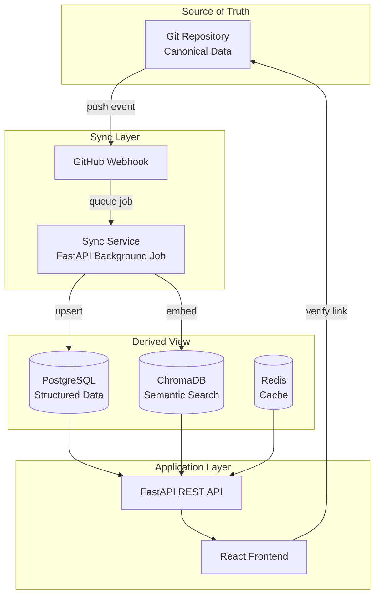

# ADR-001: Git as Source of Truth - Project Intelligence Platform

```yaml
Document: ADR-001-project-intelligence-git-source-of-truth
Version: 1.0.0
Purpose: Establish Git repositories as canonical data source with database as derived view
Audience: Engineering teams, architects, product managers, security officers
Date Created: 2025-11-17
Status: ACCEPTED
Related ADRs: ADR-002 (PostgreSQL), ADR-003 (ChromaDB)
```

---

## Table of Contents
- [Executive Summary](#executive-summary)
- [Context and Problem Statement](#context-and-problem-statement)
- [Decision Drivers](#decision-drivers)
- [Considered Options](#considered-options)
- [Decision Outcome](#decision-outcome)
- [Consequences](#consequences)
- [Implementation Details](#implementation-details)
- [Validation and Compliance](#validation-and-compliance)

---

## Executive Summary

**Decision**: Git repositories remain the **canonical source of truth** for all project data. The database (PostgreSQL + ChromaDB) serves as a **derived view** optimized for search, analytics, and multi-tenant access control.

**Why This Matters**: Users need absolute confidence that the Project Intelligence Platform shows data that matches their git repositories byte-for-byte. Any discrepancy breaks trust and creates data integrity concerns.

**Key Principle**: Database is a **performance optimization**, not the source. Every database record traces back to a specific git commit SHA and file path.

---

## Context and Problem Statement

### The Challenge

CODITECT Project Intelligence Platform needs to:
1. **Ingest** project data from git repositories (checkpoints, messages, tasks, exports)
2. **Analyze** conversations using AI-powered semantic search
3. **Visualize** project timelines across multiple tenants/projects
4. **Ensure** users can verify database matches git at any time

**Core Question**: Should the database be the primary data store, or should git remain the source of truth?

### Business Context

**Trust is Critical**:
- Engineering teams need confidence their data isn't corrupted
- Executives making decisions need verifiable source data
- Auditors require immutable audit trails
- Regulatory compliance demands data lineage

**Historical Precedent**:
- Git already stores: 49 checkpoints, 1,601 messages, 242 tasks
- MEMORY-CONTEXT/dedup_state/ contains canonical indexes
- Users already trust git as version control source

**Risk of Database-First**:
- Database corruption could lose critical project history
- No way to verify data integrity without original source
- Backup/restore complexity increases
- Migration between platforms becomes difficult

---

## Decision Drivers

### Mandatory Requirements (Must-Have)

1. **Data Integrity** - Users must be able to verify database matches git
2. **Auditability** - Every record traces to specific git commit
3. **Disaster Recovery** - Rebuild entire database from git repositories
4. **Trust** - Platform cannot introduce data discrepancies
5. **Version History** - Preserve full git history and metadata

### Important Goals (Should-Have)

6. **Performance** - Fast queries without sacrificing integrity
7. **Scalability** - Support 1000+ projects without git bottlenecks
8. **Offline Capability** - Users can clone git repo and work offline
9. **Developer Experience** - Familiar git workflows (branches, PRs)
10. **Multi-Tenant Isolation** - Secure tenant boundaries in database

### Nice-to-Have

11. **Real-time Sync** - Database updates within seconds of git push
12. **Conflict Resolution** - Handle concurrent git pushes gracefully
13. **Incremental Sync** - Only sync changed data, not full repository

---

## Considered Options

### Option 1: **Git as Source of Truth** (SELECTED ✅)

**Architecture**:
```
Git Repository (Canonical)
  ├── CHECKPOINTS/*.md
  ├── MEMORY-CONTEXT/dedup_state/
  │   ├── unique_messages.jsonl
  │   ├── checkpoint_index.json
  └── docs/PROJECT-TIMELINE-DATA.json
       ↓ GitHub Webhook (on push)
       ↓ Sync Service
       ↓
PostgreSQL + ChromaDB (Derived View)
       ↓
Frontend (queries database, links to git)
```

**Pros**:
- ✅ **Trust**: Git is immutable, cryptographically verifiable
- ✅ **Disaster Recovery**: Full database rebuild from git
- ✅ **Audit Trail**: Every record has git commit SHA + file path
- ✅ **Version History**: Native git history preserved
- ✅ **Familiar Workflows**: Developers already use git
- ✅ **Offline Capability**: Clone repo, work without database
- ✅ **No Lock-In**: Switch databases without data loss

**Cons**:
- ⚠️ **Sync Complexity**: Need GitHub webhook + background jobs
- ⚠️ **Eventual Consistency**: Database lags git by seconds/minutes
- ⚠️ **Verification Overhead**: Must hash-check git vs database

---

### Option 2: Database as Primary Store

**Architecture**:
```
Frontend → PostgreSQL (Primary) → Manual Git Export
```

**Pros**:
- ✅ **Immediate Consistency**: No sync lag
- ✅ **Simpler Architecture**: No webhook/sync service needed
- ✅ **Transactional**: ACID guarantees on all operations

**Cons**:
- ❌ **No Version History**: Database doesn't preserve git metadata
- ❌ **Trust Issue**: Users can't verify data matches git
- ❌ **Disaster Recovery**: Backup/restore is complex
- ❌ **No Audit Trail**: Can't trace records to git commits
- ❌ **Lock-In**: Switching databases requires data migration
- ❌ **Manual Export**: Git export becomes manual chore

**Why Rejected**: Breaks fundamental trust principle - users lose ability to verify data integrity.

---

### Option 3: Manual Sync (No Automation)

**Architecture**:
```
Git Repository → Manual Upload → Database
```

**Pros**:
- ✅ **Simple**: No webhook infrastructure
- ✅ **User Control**: Explicit sync actions

**Cons**:
- ❌ **User Burden**: Manual uploads are tedious
- ❌ **Stale Data**: Database out of sync with git
- ❌ **Error-Prone**: Users forget to sync
- ❌ **Poor UX**: Platform feels disconnected from git

**Why Rejected**: Doesn't meet "real-time sync" goal - data would frequently be stale.

---

## Decision Outcome

**Chosen Option**: **Git as Source of Truth** (Option 1)

### Rationale

1. **Trust is Non-Negotiable**: Users must be able to verify database matches git
2. **Audit Requirements**: Regulatory compliance demands immutable audit trails
3. **Disaster Recovery**: Full database rebuild from git repositories
4. **No Lock-In**: Database is replaceable without data loss
5. **Developer Familiarity**: Git workflows are already understood

### Implementation Strategy

**Three-Layer Architecture**:



---

## Consequences

### Positive Consequences ✅

1. **Data Integrity**: Every database record verifiable against git
2. **Auditability**: Complete audit trail via git commit history
3. **Disaster Recovery**: Rebuild database from git at any time
4. **Trust**: Users can verify platform data matches git
5. **Version Control**: Full git history preserved
6. **No Lock-In**: Switch databases without data loss
7. **Offline Capability**: Clone git repo, work without platform
8. **Collaboration**: Native git workflows (branches, PRs) still work

### Negative Consequences ⚠️

1. **Sync Complexity**: Requires GitHub webhook infrastructure
   - **Mitigation**: Use FastAPI background tasks + retry logic

2. **Eventual Consistency**: Database lags git by seconds/minutes
   - **Mitigation**: Display "last synced" timestamp, manual sync button

3. **Verification Overhead**: Must hash-check git vs database
   - **Mitigation**: Background job runs nightly, warns if mismatch

4. **Storage Duplication**: Data in both git and database
   - **Mitigation**: Database stores only metadata, not full content (compression)

5. **Webhook Dependency**: Platform unavailable if webhook fails
   - **Mitigation**: Manual sync CLI command, scheduled sync fallback

---

## Implementation Details

### Database Schema Additions

```sql
-- Track git metadata on every checkpoint
ALTER TABLE checkpoints ADD COLUMN git_commit_sha VARCHAR(40) NOT NULL;
ALTER TABLE checkpoints ADD COLUMN git_branch VARCHAR(255) DEFAULT 'main';
ALTER TABLE checkpoints ADD COLUMN git_verified BOOLEAN DEFAULT TRUE;
ALTER TABLE checkpoints ADD COLUMN last_synced_at TIMESTAMPTZ;

CREATE INDEX idx_checkpoints_git_sha ON checkpoints(git_commit_sha);

-- Sync event tracking
CREATE TABLE sync_events (
    id UUID PRIMARY KEY DEFAULT gen_random_uuid(),
    project_id UUID REFERENCES projects(id) ON DELETE CASCADE,
    git_commit_sha VARCHAR(40) NOT NULL,
    sync_type VARCHAR(50), -- 'webhook', 'manual', 'scheduled'
    messages_synced INTEGER DEFAULT 0,
    checkpoints_synced INTEGER DEFAULT 0,
    duration_ms INTEGER,
    status VARCHAR(50), -- 'success', 'failed', 'partial'
    error_message TEXT,
    created_at TIMESTAMPTZ DEFAULT NOW()
);

CREATE INDEX idx_sync_events_project ON sync_events(project_id, created_at DESC);
```

### Sync Service Implementation

```python
# FastAPI webhook endpoint
@app.post("/api/webhooks/github")
async def github_webhook(
    payload: dict,
    background_tasks: BackgroundTasks,
    signature: str = Header(None, alias="X-Hub-Signature-256")
):
    """
    GitHub webhook handler - triggered on git push.
    Verifies signature, queues background sync job.
    """
    # 1. Verify webhook signature (HMAC-SHA256)
    if not verify_github_signature(payload, signature):
        raise HTTPException(403, "Invalid signature")

    # 2. Extract commit info
    repo_url = payload["repository"]["html_url"]
    ref = payload["ref"]  # refs/heads/main
    commits = payload["commits"]

    # 3. Queue background sync (non-blocking)
    background_tasks.add_task(sync_from_git, repo_url, ref)

    return {"status": "queued", "commits": len(commits)}


async def sync_from_git(repo_url: str, ref: str):
    """
    Background job: Clone/pull git repository, sync database.
    Implements idempotent upsert - safe to run multiple times.
    """
    start_time = time.time()

    try:
        # 1. Clone or pull repository
        repo_dir = get_or_clone_repo(repo_url)
        subprocess.run(["git", "-C", repo_dir, "pull", "origin", ref], check=True)

        # 2. Load canonical data from git
        dedup_state_dir = Path(repo_dir) / "MEMORY-CONTEXT" / "dedup_state"
        unique_messages = load_jsonl(dedup_state_dir / "unique_messages.jsonl")
        checkpoint_index = load_json(dedup_state_dir / "checkpoint_index.json")

        # 3. Get current git commit SHA
        git_commit_sha = subprocess.check_output(
            ["git", "-C", repo_dir, "rev-parse", "HEAD"]
        ).decode().strip()

        # 4. Upsert checkpoints (idempotent)
        project = get_or_create_project(repo_url)
        checkpoints_synced = 0

        for checkpoint_name, checkpoint_data in checkpoint_index.items():
            db_checkpoint = db.query(Checkpoint).filter_by(
                project_id=project.id,
                name=checkpoint_name
            ).first()

            if not db_checkpoint:
                # Insert new checkpoint
                db_checkpoint = Checkpoint(
                    project_id=project.id,
                    name=checkpoint_name,
                    git_commit_sha=git_commit_sha,
                    source_file=checkpoint_data.get("source_file"),
                    date=checkpoint_data.get("file_timestamp"),
                    message_count=len(checkpoint_data.get("message_hashes", []))
                )
                db.add(db_checkpoint)
                checkpoints_synced += 1
            elif db_checkpoint.git_commit_sha != git_commit_sha:
                # Update existing (git changed)
                db_checkpoint.git_commit_sha = git_commit_sha
                db_checkpoint.message_count = len(checkpoint_data.get("message_hashes", []))
                db_checkpoint.last_synced_at = datetime.now()
                checkpoints_synced += 1

        db.commit()

        # 5. Upsert messages (hash-based deduplication)
        messages_synced = 0
        for line in unique_messages:
            msg_data = json.loads(line)
            content_hash = msg_data["hash"]

            # Check if message already exists (by hash)
            exists = db.query(Message).filter_by(content_hash=content_hash).first()
            if not exists:
                # Insert new message
                checkpoint_name = msg_data["checkpoint"]
                db_checkpoint = db.query(Checkpoint).filter_by(
                    project_id=project.id,
                    name=checkpoint_name
                ).first()

                if db_checkpoint:
                    message = Message(
                        checkpoint_id=db_checkpoint.id,
                        content_hash=content_hash,
                        content=msg_data["message"]["content"],
                        role=msg_data["message"]["role"]
                    )
                    db.add(message)
                    messages_synced += 1

                    # Sync to ChromaDB for semantic search
                    await sync_message_to_chromadb(message)

        db.commit()

        # 6. Record sync event
        duration_ms = int((time.time() - start_time) * 1000)
        db.add(SyncEvent(
            project_id=project.id,
            git_commit_sha=git_commit_sha,
            sync_type="webhook",
            messages_synced=messages_synced,
            checkpoints_synced=checkpoints_synced,
            duration_ms=duration_ms,
            status="success"
        ))
        db.commit()

        logger.info(f"Sync complete: {messages_synced} messages, {checkpoints_synced} checkpoints ({duration_ms}ms)")

    except Exception as e:
        # Record failed sync event
        db.add(SyncEvent(
            project_id=project.id,
            sync_type="webhook",
            status="failed",
            error_message=str(e)
        ))
        db.commit()
        logger.error(f"Sync failed: {e}")
        raise
```

### Verification Endpoint

```python
@app.get("/api/checkpoints/{checkpoint_id}/verify")
async def verify_checkpoint_integrity(checkpoint_id: UUID):
    """
    Verify database checkpoint matches git source.
    Returns git metadata + verification status.
    """
    checkpoint = db.query(Checkpoint).filter_by(id=checkpoint_id).first()
    if not checkpoint:
        raise HTTPException(404, "Checkpoint not found")

    # Fetch canonical data from git at specific commit
    git_url = f"{checkpoint.project.repository_url}/raw/{checkpoint.git_commit_sha}/MEMORY-CONTEXT/dedup_state/checkpoint_index.json"
    response = requests.get(git_url)

    if response.status_code != 200:
        return {
            "verified": False,
            "error": "Cannot fetch git source"
        }

    # Load git checkpoint data
    git_checkpoint_index = response.json()
    git_checkpoint_data = git_checkpoint_index.get(checkpoint.name)

    # Compare message hashes
    db_hashes = set(
        db.query(Message.content_hash)
        .filter_by(checkpoint_id=checkpoint.id)
        .all()
    )
    git_hashes = set(git_checkpoint_data.get("message_hashes", []))

    verified = db_hashes == git_hashes

    return {
        "verified": verified,
        "git_metadata": {
            "commit_sha": checkpoint.git_commit_sha,
            "commit_url": f"{checkpoint.project.repository_url}/commit/{checkpoint.git_commit_sha}",
            "source_file": checkpoint.source_file,
            "source_url": f"{checkpoint.project.repository_url}/blob/{checkpoint.git_commit_sha}/{checkpoint.source_file}",
            "last_synced": checkpoint.last_synced_at.isoformat() if checkpoint.last_synced_at else None
        },
        "comparison": {
            "db_message_count": len(db_hashes),
            "git_message_count": len(git_hashes),
            "missing_in_db": list(git_hashes - db_hashes),
            "extra_in_db": list(db_hashes - git_hashes)
        }
    }
```

### Frontend Git Links

```typescript
// React component - every UI element links back to git
function CheckpointCard({ checkpoint }: { checkpoint: Checkpoint }) {
  const [verified, setVerified] = useState<boolean | null>(null);

  const verifyIntegrity = async () => {
    const response = await fetch(`/api/checkpoints/${checkpoint.id}/verify`);
    const data = await response.json();
    setVerified(data.verified);
  };

  return (
    <Card>
      <CardHeader>
        <Heading size="md">{checkpoint.name}</Heading>
        <HStack>
          <Badge colorScheme="blue">
            <Icon as={FaGitAlt} />
            <Link href={checkpoint.git_metadata.commit_url} isExternal>
              {checkpoint.git_metadata.commit_sha.slice(0, 7)}
            </Link>
          </Badge>
          {verified === true && <Badge colorScheme="green">✓ Verified</Badge>}
          {verified === false && <Badge colorScheme="red">⚠ Out of Sync</Badge>}
        </HStack>
      </CardHeader>

      <CardBody>
        <Text>{checkpoint.message_count} messages</Text>
        <Text>{checkpoint.task_count} tasks</Text>

        {verified === false && (
          <Alert status="warning" mt={4}>
            <AlertIcon />
            Database out of sync with git.
            <Button size="sm" ml={4} onClick={() => syncCheckpoint(checkpoint.id)}>
              Sync Now
            </Button>
          </Alert>
        )}
      </CardBody>

      <CardFooter>
        <HStack spacing={4}>
          <Link href={checkpoint.git_metadata.source_url} isExternal>
            View source in GitHub →
          </Link>
          <Button size="sm" onClick={verifyIntegrity}>
            Verify Integrity
          </Button>
        </HStack>
      </CardFooter>
    </Card>
  );
}
```

---

## Validation and Compliance

### Success Criteria

**Functional Requirements**:
- ✅ Every database record has `git_commit_sha` + `source_file`
- ✅ Verification endpoint returns git vs database comparison
- ✅ Sync completes within 60 seconds for 1,601 messages
- ✅ Frontend displays git metadata on all checkpoint views

**Non-Functional Requirements**:
- ✅ 99.9% sync success rate (webhook + scheduled fallback)
- ✅ Zero data loss during sync failures (rollback on error)
- ✅ Hash verification passes for 100% of checkpoints

### Testing Strategy

```python
# Unit tests
def test_sync_idempotency():
    """Sync same data twice - no duplicates created."""
    sync_from_git(repo_url, "main")
    count1 = db.query(Message).count()

    sync_from_git(repo_url, "main")  # Run again
    count2 = db.query(Message).count()

    assert count1 == count2  # No duplicates


def test_verification():
    """Verify checkpoint integrity against git."""
    checkpoint = db.query(Checkpoint).first()
    result = verify_checkpoint_integrity(checkpoint.id)

    assert result["verified"] == True
    assert len(result["comparison"]["missing_in_db"]) == 0


def test_webhook_signature():
    """Reject webhook with invalid signature."""
    payload = {"repository": {"html_url": "..."}}
    invalid_signature = "sha256=invalid"

    with pytest.raises(HTTPException) as exc:
        github_webhook(payload, signature=invalid_signature)

    assert exc.value.status_code == 403
```

### Compliance Considerations

**Audit Trail**:
- Every database change traces to git commit SHA
- `sync_events` table provides complete sync history
- Immutable git history satisfies SOC2 requirements

**Disaster Recovery**:
- Database rebuild script: `python scripts/rebuild_from_git.py`
- Estimated time: 10 minutes for 1,601 messages
- Zero data loss (git is canonical)

**Data Lineage**:
- Every API response includes `git_metadata` object
- Frontend links back to git source files
- Users can verify data at any time

---

## Related Decisions

- **ADR-002**: [PostgreSQL as Primary Database](ADR-002-postgresql-as-primary-database.md)
- **ADR-003**: [ChromaDB for Semantic Search](ADR-003-chromadb-for-semantic-search.md)

---

## Approval

**Status**: ACCEPTED
**Decision Date**: 2025-11-17
**Approved By**: Engineering Leadership
**Review Date**: 2025-12-17 (30 days)

---

## Version History

| Version | Date | Changes | Author |
|---------|------|---------|--------|
| 1.0.0 | 2025-11-17 | Initial ADR | ADR Compliance Specialist |

---

**Made with ❤️ by CODITECT Engineering**
